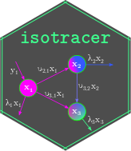

isotracer: an R package for the analysis of tracer addition experiments 
=======================================================================

<!-- badges start -->

[](https://cran.r-project.org/package=isotracer)
[](https://gitlab.com/matthieu-bruneaux/isotracer/-/commits/master)
[](https://matthieu-bruneaux.gitlab.io/isotracer/)
[](https://matthieu-bruneaux.gitlab.io/isotracer/coverage/coverage.html)
<!-- [](https://matthieu-bruneaux.gitlab.io/isotracer/R-CMD-check_output.txt) -->
[](https://lifecycle.r-lib.org/articles/stages.html)

<!-- badges end -->

Isotope tracer addition experiments are used to answer a wide variety of biological, ecological and evolutionary questions. In these experiments, a labeled element is injected into a biological system and its fate is traced throughout the system to estimate the flux of matter across compartments. Tracer additions can be used across all levels of biological organization from cells and tissues, to organisms and ecosystems. The **isotracer** package provides tools to analyze data from such experiments.

## Getting started

The recommended way to install the package is to get the latest version from CRAN:

```
install.packages("isotracer")
```

The documentation for the latest stable version is [available online](https://matthieu-bruneaux.gitlab.io/isotracer/). Start with the [Quick Start](https://matthieu-bruneaux.gitlab.io/isotracer/articles/tutorial-010-quick-start.html) tutorial!

If you are feeling adventurous, you might want to install the latest development version from GitLab. It might have new features that the stable version on CRAN doesn't have yet, but it might also be less stable:

```
devtools::install_gitlab("matthieu-bruneaux/isotracer")
```

## How to cite the package

Running `citation("isotracer")` will return two references you can use if you want to cite isotracer.

The first reference is the paper describing the original method:

- López-Sepulcre A, Bruneaux M, Collins SM, El-Sabaawi R, Flecker AS, Thomas SA
(2020). “A new method to reconstruct quantitative food webs and nutrient flows
from isotope tracer addition experiments.” _The American Naturalist_, *195*(6),
964-985. doi: 10.1086/708546 (URL: https://doi.org/10.1086/708546).

The second reference is the paper introducing isotracer itself:

- Bruneaux M, López-Sepulcre A (2022). “isotracer: An R package for the analysis of
tracer addition experiments.” _Methods in Ecology and Evolution_, *13*(5),
1119-1134. doi: 10.1111/2041-210X.13822 (URL:
https://doi.org/10.1111/2041-210X.13822).

## Contact

- [Matthieu Bruneaux](mailto:matthieu.bruneaux@gmail.com)
- [Andrés López-Sepulcre](mailto:lopezsepulcre@gmail.com)
