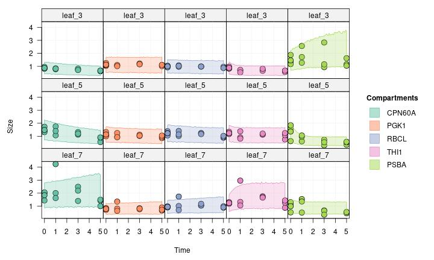

This case study estimates protein turnover in *Arabidopsis thaliana* from experiment where seeds are grown on 15N medium. The data is taken from the following article:

- Li, Lei, Clark J. Nelson, Josua Trösch, Ian Castleden, Shaobai Huang, and
  A. Harvey Millar. “Protein Degradation Rate in Arabidopsis Thaliana Leaf
  Growth and Development.” The Plant Cell 29, no. 2 (February 1, 2017):
  207–28. https://doi.org/10.1105/tpc.16.00768.

In this article, the authors use chromatography, gel electrophoresis and mass spectrometry to estimate the degradation rate of 1228 proteins in *Arabidopsis* leaves. The data from their study was deposited on Dryad:

- Li, Lei, Clark J. Nelson, Josua Troesch, Ian Castleden, Shaobai Huang, and
  A. Harvey Millar. “Data from: Protein Degradation Rate in Arabidopsis
  Thaliana Leaf Growth and Development.”
  Dryad, 2018. https://doi.org/10.5061/DRYAD.Q3H85.

A subset of the Dryad dataset is included in the datasets shipped with
`isotracer`.

## Experiment and data

The experiment in Li et al. (2017) aims at measuring the in vivo degradation rate of proteins in young plants (21-day old) in three different leaf tissues (3rd, 5th and 7th leaves). Obtaining turnover estimates for a very large number of proteins enabled them to examine the determinants of protein degradation rates, such as protein domains and membership in protein complexes, and to analyze proteins for which degradation rates differ between leaves.

In brief, seeds were grown on a medium with naturally abundant N isotopes (mostly 14N) and switched to a 15N medium after 21 days. Leaves 3, 5, and 7 were taken from plants at 21 days (t0), 22 days (t1), 24 days (t2) and 26 days (t3). Each sample consisted of four leaves (from four individual plants) pooled together into one biological replicate. For each leaf type and sampling time, three such replicates were collected.

Leaf samples were used for protein separation on gel, digestion and mass spectrometry analysis in order to identify proteins and estimate their labelled fraction.

In addition, a similar experiment was performed in which the seeds were grown only on natural N isotope medium (mostly 14N) and leaves were sampled at similar time points (without pooling multiple individuals). Those leaves were used in chromatography and mass spectrometry analysis to estimate relative abundance fold changes for individual proteins.

The data shipped with `isotracer` is:

- `li2017`: a table providing relative abundance and labelled fraction data for individual proteins, for different days and different leaf types
- `li2017_prots`: a table mapping the protein identifiers from `li2017` to their description
- `li2017_counts`: a summary table giving the number of relative abundance data points and of labelled fraction data points for each protein.

This is how the relative abundance and labelled fraction data looks like:


```r
li2017
```

```
## # A tibble: 59,048 × 6
##    prot_id                 sample rel_abundance labeled_fraction time_day leaf_id
##    <chr>                   <chr>          <dbl>            <dbl>    <dbl> <chr>  
##  1 AT1G01050.1             T0L3R3         1.29                NA        0 leaf_3 
##  2 AT1G01050.1             T0L5R3         1.29                NA        0 leaf_5 
##  3 AT1G01080.1,AT1G01080.2 T0L3R1         0.972               NA        0 leaf_3 
##  4 AT1G01080.1,AT1G01080.2 T0L3R2         1.10                NA        0 leaf_3 
##  5 AT1G01080.1,AT1G01080.2 T0L3R3         0.854               NA        0 leaf_3 
##  6 AT1G01080.1,AT1G01080.2 T0L5R1         1.37                NA        0 leaf_5 
##  7 AT1G01080.1,AT1G01080.2 T0L5R2         1.07                NA        0 leaf_5 
##  8 AT1G01080.1,AT1G01080.2 T0L5R3         0.747               NA        0 leaf_5 
##  9 AT1G01080.1,AT1G01080.2 T0L7R1         0.332               NA        0 leaf_7 
## 10 AT1G01080.1,AT1G01080.2 T0L7R2         1.09                NA        0 leaf_7 
## # ℹ 59,038 more rows
```

In this case study, we will only focus on a handful of proteins and use `isotracer` to estimate their turnover in *Arabidopsis* leaves. These are the proteins we selected for this case study:

- ATCG00490.1 (**RBCL**, ribulose-bisphosphate carboxylase or "rubisco", the most abundant protein in leaves in ppm)
- AT5G54770.1 (**THI1**, thiazole biosynthetic enzyme)
- AT2G28000.1 (**CPN60A**, a chaperone involved in rubisco folding)
- ATCG00020.1 (**PSBA**, a protein of the photosystem II)
- AT3G12780.1 (**PGK1**, phospohoglycerate kinase 1)


```r
# Setup
library(isotracer)
library(tidyverse)
```


## Building the model

### Network topology

There are several ways in which the biological question at hand can be answered with isotracer. Here, we choose to use a network model where the topology is very simple: each of the five protein compartments receives nitrogen "directly" from the growth medium. This topology is replicated in three instances, one for each leaf tissue. This assumes that no exchange of nitrogen across proteins or across leaves occurs once nitrogen is incorporated into a protein.

We initialize the network model with the corresponding topology, which is very simple: each protein pool is incorporating N as the corresponding protein is synthetized.


```r
m <- new_networkModel() %>%
  set_topo("medium -> RBCL, THI1, CPN60A, PSBA, PGK1")
```

We assumes that the N content in the medium is so large it is constant compared to the leaf pools and set it to a steady state in the model. This is equivalent to the zero-order process assumed by Li et al. for protein synthesis.


```r
m <- m %>% set_steady("medium")
```

Finally, the protein labelling in this experiment can be very high (proteins with a rapid turnover can be 100% labelled after a few days). This means that the default gamma distribution used to model observed labelled fractions is not appropriate, and we use a beta distribution instead:


```r
m <- m %>% set_prop_family("beta_phi")
```

With this family, the model parameter $\eta$ represents the precision parameter $\phi$ of a beta distribution.

Let's have a look at our network topology:


```r
ggtopo(m)
```


### Initial conditions and observations

Let's get the data for those proteins. At the same time, we map the protein identifiers to something slightly easier to read, and we also rename the protein ID column to `compartment` because we will have to add the medium nitrogen pool later:


```r
prots <- c("ATCG00490.1" = "RBCL", "AT5G54770.1" = "THI1", "AT2G28000.1" = "CPN60A",
           "ATCG00020.1" = "PSBA", "AT3G12780.1" = "PGK1")
data <- li2017 %>%
  filter(prot_id %in% names(prots)) %>%
  mutate(prot = prots[prot_id]) %>%
  rename(compartment = prot) %>%
  select(compartment, leaf_id, time_day, rel_abundance, labeled_fraction)
data
```

```
## # A tibble: 284 × 5
##    compartment leaf_id time_day rel_abundance labeled_fraction
##    <chr>       <chr>      <dbl>         <dbl>            <dbl>
##  1 CPN60A      leaf_3         0         0.837               NA
##  2 CPN60A      leaf_3         0         0.818               NA
##  3 CPN60A      leaf_3         0         0.953               NA
##  4 CPN60A      leaf_5         0         1.40                NA
##  5 CPN60A      leaf_5         0         1.31                NA
##  6 CPN60A      leaf_5         0         1.73                NA
##  7 CPN60A      leaf_7         0         1.44                NA
##  8 CPN60A      leaf_7         0         2.03                NA
##  9 CPN60A      leaf_7         0         2.06                NA
## 10 CPN60A      leaf_3         1         0.774               NA
## # ℹ 274 more rows
```

We get the initial conditions. Because there are several replicates, we will take their average as the starting condition:


```r
inits <- data %>%
  filter(time_day == 0) %>%
  group_by(compartment, leaf_id, time_day) %>%
  summarize(rel_abundance = mean(rel_abundance), .groups = "drop")
inits
```

```
## # A tibble: 15 × 4
##    compartment leaf_id time_day rel_abundance
##    <chr>       <chr>      <dbl>         <dbl>
##  1 CPN60A      leaf_3         0         0.870
##  2 CPN60A      leaf_5         0         1.48 
##  3 CPN60A      leaf_7         0         1.84 
##  4 PGK1        leaf_3         0         1.12 
##  5 PGK1        leaf_5         0         1.13 
##  6 PGK1        leaf_7         0         0.785
##  7 PSBA        leaf_3         0         1.46 
##  8 PSBA        leaf_5         0         1.36 
##  9 PSBA        leaf_7         0         0.993
## 10 RBCL        leaf_3         0         0.993
## 11 RBCL        leaf_5         0         1.23 
## 12 RBCL        leaf_7         0         0.944
## 13 THI1        leaf_3         0         0.878
## 14 THI1        leaf_5         0         1.23 
## 15 THI1        leaf_7         0         1.24
```

Those initial conditions lack two things: the initial labelled fraction and the data for the medium nitrogen pool. We will assume that the starting labelled fraction is the standard 15N abundance (0.3663%). For the medium, which is in steady state, we use a dummy relative abundance of 1 and a labeled fraction of 1 because almost all the N is 15N during the experiment.


```r
inits <- inits %>%
  mutate(labeled_fraction = 0.003663)
# We use the same medium specifications for all proteins
inits_medium <- tibble(compartment = "medium", rel_abundance = 1, labeled_fraction = 1) %>%
  crossing(inits %>% select(leaf_id) %>% unique())
# Put it all together
inits <- bind_rows(inits, inits_medium)
```

Now we can set those initial conditions in the model:


```r
m <- m %>% set_init(inits, comp = "compartment", size = "rel_abundance",
                    prop = "labeled_fraction", group_by = "leaf_id")
```


```r
# If we had the PaxDB abundance data we can convert the relative flows to
# absolute flows, in addition to having the turnover estimates.

# Another way to see things would be to have only two compartments, medium and
# protein, and use leaf and prot as grouping facto (probably not the best
# option).
```

We add the observations to the model:


```r
m <- m %>% set_obs(data, time = "time_day")
```

Finally, we specify that all the rates will be dependent on the leaf identity:


```r
m <- m %>% add_covariates(upsilon + lambda ~ leaf_id)
```

This results in quite a few parameters to be estimated by the model:


```r
params(m)
```

```
## # A tibble: 35 × 2
##    in_model             value
##    <chr>                <dbl>
##  1 eta                     NA
##  2 lambda_CPN60A|leaf_3    NA
##  3 lambda_CPN60A|leaf_5    NA
##  4 lambda_CPN60A|leaf_7    NA
##  5 lambda_medium|leaf_3    NA
##  6 lambda_medium|leaf_5    NA
##  7 lambda_medium|leaf_7    NA
##  8 lambda_PGK1|leaf_3      NA
##  9 lambda_PGK1|leaf_5      NA
## 10 lambda_PGK1|leaf_7      NA
## # ℹ 25 more rows
```

## Running the model

We have to specify the priors before running the model.

The time units for the observations are days, and the experimental data spans five days. It is unlikely than the whole nitrogen stock of a compartment turns over in less than a day, so slightly informative priors for `lambda_*` rates can be `normal_p(0, 2)` for example:


```r
m <- set_priors(m, normal_p(0, 2), "lambda")
```

All `upsilon_*` rates are from the medium to a protein pool. Since medium is a dummy, steady state compartment with size arbitrarily set to 1, we want the `upsilon_*`priors to allow for roughly the same compartment turnover as the `lambda_*` priors. Observed compartment sizes are mostly around 1 but can go as high as above 4, so let's use `normal_p(0, 8)` for a slightly informative prior on `upsilon_*`:


```r
m <- set_priors(m, normal_p(0, 8), "upsilon")
```

Furthermore, since `medium` is a steady state compartment, let's set its `lambda` parameter to a dummy constant to save a bit of effort during MCMC:


```r
m <- set_prior(m, constant_p(0), "lambda_medium")
```

Now we only have the `eta` and `zeta` parameters left. Since $\eta$ is the precision of the beta distribution for observed proportions, it can be quite high. Let's set a very permissive prior:


```r
prop_family(m)
```

```
## [1] "beta_phi"
```

```r
m <- set_prior(m, normal_p(mean = 50, sd = 50), "^eta")
```

Finally, `zeta` is the coefficient of variation of normal distributions for observed compartment sizes. Let's allow for some reasonably large noise:


```r
size_family(m)
```

```
##   (zeta is the coefficient of variation of normal distributions.)
```

```
## [1] "normal_cv"
```

```r
m <- set_prior(m, normal_p(0, 3), "zeta")
```

```
## Prior modified for parameter(s): 
##   - zeta
```

All the priors are set. Let's run the model:


```r
run <- run_mcmc(m, iter = 2000)
plot(run)
# Note: the figure below only shows a few of the traceplots for vignette concision
```


## Posterior predictive checks

Let's see how the model fits the observations:


```r
pred <- predict(m, run, draws = 500)
```


```r
plot(pred, facet_row = "group", facet_col = "compartment", type = "prop",
     scale = "all", comps = c("CPN60A", "PGK1", "RBCL", "THI1", "PSBA"))
```


```r
plot(pred, facet_row = "group", facet_col = "compartment", type = "size",
     scale = "all", comps = c("CPN60A", "PGK1", "RBCL", "THI1", "PSBA"))
```



The model performs well to predict both labelled fractions and relative abundances.

## Interpretation

One of the aims of the original paper was to estimate the turnover rate of as many proteins as possible in the three leaf types, and compare those rates across leaves and proteins. Note that since each protein pool is not transferring nitrogen to any other compartment, its turnover rate is simply equal to $\lambda$.

Turnover rates are overall lower in leaf 3, and very large differences exist between proteins. Large difference between leaves for a given protein:


```r
library(ggplot2)
library(ggdist)

lambdas <- run %>% select("lambda") %>%
  tidy_mcmc() %>%
  mutate(mcmc.parameters = map(mcmc.parameters, enframe)) %>%
  pull(mcmc.parameters) %>%
  bind_rows() %>%
  separate(name, sep = "[|]", into = c("param", "leaf")) %>%
  mutate(prot = substr(param, 8, nchar(param)))

lambdas %>% group_by(prot, leaf) %>%
  median_qi(value, .width = c(0.8, 0.95)) %>%
  ggplot(aes(x = leaf, y = value, ymin = .lower, ymax = .upper)) +
  facet_grid(. ~ prot) +
  geom_pointinterval() +
  coord_trans(y = "log10") + 
  labs(y = "lambda (day-1)")
```


Conversely, the turnover times (calculated as the inverse of the turnover rates) range from less than 12 hours to tens of days, depending on the protein and on the leaf:


```r
totimes <- lambdas %>% mutate(value = 1/value)

totimes %>% group_by(prot, leaf) %>%
  median_qi(value, .width = c(0.8, 0.95)) %>%
  ggplot(aes(x = leaf, y = value, ymin = .lower, ymax = .upper)) +
  facet_grid(. ~ prot) +
  geom_pointinterval() +
  coord_trans(y = "log10") +
  scale_y_continuous(breaks = c(1, 3, 5, 10, 20, 40, 60)) + 
  labs(y = "turnover time (day)")
```


## Sankey plots

We can calculate the flows from the model output. Note that those flows are not in absolute quantity of N since the protein pool sizes used here are the relative abundances compared to a reference sample. Those values could be converted to absolute values using the PaxDB which provides estimates of protein abundances for Arabidopsis (cf. the original paper).

Let's calculate the estimated average flows over the time of the experiment:


```r
flows <- tidy_flows(m, run, n = 500)
```


Let's draw a Sankey plot for the 3rd and 7th leaves (note that the scaling is different between the two panels so they are not directly comparable, but the relative scalings of the flows and of the turnover times within each panel are correct):


```r
library(grid)
grid.newpage()

vp <- viewport(layout = grid.layout(ncol = 2))
pushViewport(vp)

pushViewport(viewport(layout.pos.col = 1))
flows_3 <- flows %>% filter_by_group(leaf_id == "leaf_3")
quick_sankey(flows_3, node_s = "roundsquare", edge_f = 0.25, new = FALSE)
popViewport()

pushViewport(viewport(layout.pos.col = 2))
flows_7 <- flows %>% filter_by_group(leaf_id == "leaf_7")
quick_sankey(flows_7, node_s = "roundsquare", edge_f = 0.25, new = FALSE)
popViewport()
```


