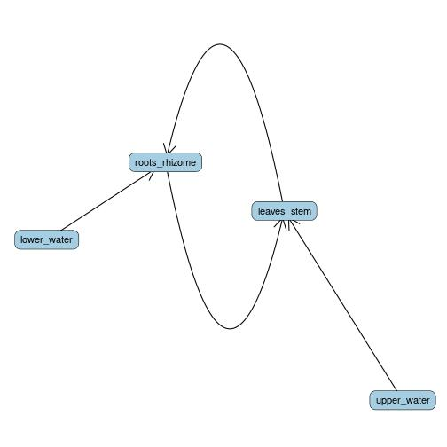
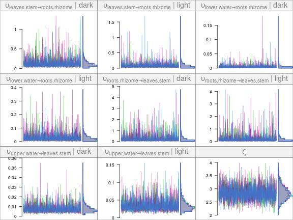
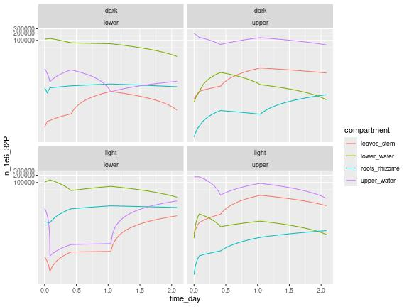
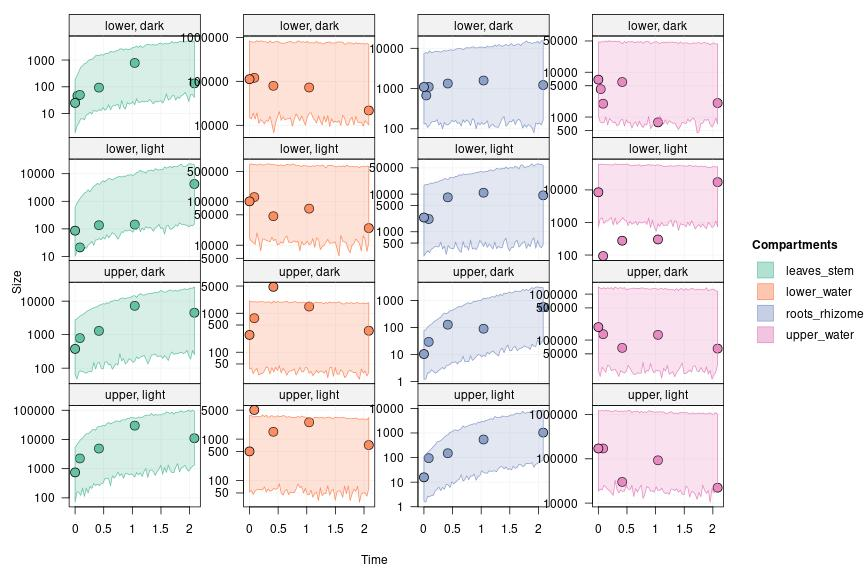
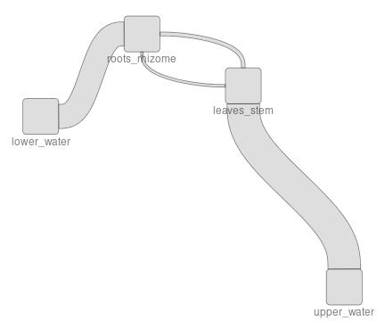

This case study models phosphorus uptake at the organism level in eelgrass from a dataset adapted from the following article:

- McRoy, C. Peter, and Robert J. Barsdate. “Phosphate Absorption in Eelgrass1.” Limnology and Oceanography 15, no. 1 (January 1, 1970): 6–13. https://doi.org/10.4319/lo.1970.15.1.0006.

## Biological question and experimental setup

Eelgrass can be present in dense populations in shallow water areas, and can have an important role in nutrients cycles in the ecosystems it is present in.

The McRoy 1970 study examines the uptake of phosphorus by eelgrass plants from the surrounding water or sediment and its transfer in the plant tissues. What is the preferred uptake pathway for phosphorus (leaves or roots)? How fast is it exchanged across plant tissues? Do the uptake processes depend on light conditions?

The experimental setup consists in individual eelgrass plants kept in closed jars, with a watertight septum separating the upper and the lower compartments. The upper compartment contains the leaves and stems of the plant, while the lower compartment contais the roots and rhizome. 32P is added as phosphate to either the upper or lower water compartment, and jars are kept in either light or dark conditions. At several time points over the course of two days, individual plants are taken from the experiment and 32P abundance in the water and in the plant tissues is quantified by measuring radioactive decay (cpm/mg of dry material).

## Modelling

### Data preparation


```r
library(tidyverse)
library(isotracer)
```


The data is available in `eelgrass`:


```r
eelgrass
```

```
## # A tibble: 83 × 7
##    light_treatment addition_site compartment time_min n_32P_per_mg mass_mg      n_32P
##    <chr>           <chr>         <chr>          <int>        <dbl>   <dbl>      <dbl>
##  1 dark            upper         leaves_stem        1     8163097.      46     3.76e8
##  2 dark            upper         leaves_stem      120    17135877.      46     7.88e8
##  3 dark            upper         leaves_stem      600    28156120.      46     1.30e9
##  4 dark            upper         leaves_stem     1500   157367757.      46     7.24e9
##  5 dark            upper         leaves_stem     3000    97868573.      46     4.50e9
##  6 dark            upper         lower_water        1        3474.   80000     2.78e8
##  7 dark            upper         lower_water      120        9332.   80000     7.47e8
##  8 dark            upper         lower_water      600       59509.   80000     4.76e9
##  9 dark            upper         lower_water     1500       18571.   80000     1.49e9
## 10 dark            upper         lower_water     3000        4448.   80000     3.56e8
## # ℹ 73 more rows
```

In this experiment, we only have observations for the total amount of 32P per compartment (we do not measure the amount of 31P). The `isotracer` model will be provided with proportions of 1 for all measurements, and we will not estimate $\eta$ in the model:


```r
eelgrass <- eelgrass %>% mutate(prop = 1)
```

We modify the data so that the time is given in days (this will make specifying the half-life of 32P more straightforward since it is usually given in days). We also modify the units for the abundance of 32P: instead of atom counts we will use $10^6$ atoms to make things more readable:


```r
eelgrass <- eelgrass %>%
  mutate(time_day = time_min / (24 * 60),
         n_1e6_32P = n_32P / 1e6)
```

We keep only the columns we will need for the modelling:


```r
eelgrass <- eelgrass %>%
  select(compartment, time_day, n_1e6_32P, prop, light_treatment, addition_site)
```

This is our table ready for the model specification:


```r
eelgrass
```

```
## # A tibble: 83 × 6
##    compartment time_day n_1e6_32P  prop light_treatment addition_site
##    <chr>          <dbl>     <dbl> <dbl> <chr>           <chr>        
##  1 leaves_stem 0.000694      376.     1 dark            upper        
##  2 leaves_stem 0.0833        788.     1 dark            upper        
##  3 leaves_stem 0.417        1295.     1 dark            upper        
##  4 leaves_stem 1.04         7239.     1 dark            upper        
##  5 leaves_stem 2.08         4502.     1 dark            upper        
##  6 lower_water 0.000694      278.     1 dark            upper        
##  7 lower_water 0.0833        747.     1 dark            upper        
##  8 lower_water 0.417        4761.     1 dark            upper        
##  9 lower_water 1.04         1486.     1 dark            upper        
## 10 lower_water 2.08          356.     1 dark            upper        
## # ℹ 73 more rows
```

### Model fitting

There are two treatments with two levels each (light/dark and 32P added in upper/lower water compartment) and the treatments are crossed.

We will assume that the rates defining the phosphorus flows do not depend on the compartment where 32P is added, but that the light conditions can have an effect on the rates. In other words: light condition is a covariate for the rates, while addition compartment is simply a replication unit.

Let's consider the following network topology:


```r
m <- new_networkModel() %>%
  set_topo("upper_water -> leaves_stem -> roots_rhizome",
           "lower_water -> roots_rhizome -> leaves_stem")
ggtopo(m)
```



Note that to make the model more amenable, we have neglected the release of phosphorus by the plant into the water (but this is actually an important biological process!).

(When including release from the plant, the model estimates some very high exchange rates!)

32P is a radioactive compound and undergoes decay, which has to be taken into account in the model given the experiment time scale. The half-life of 32P is about 14 days:


```r
m <- m %>% set_half_life(14.268)
```

Let's separate the initial conditions from the later observations:


```r
init <- filter(eelgrass, time_day < 0.01)
obs <- filter(eelgrass, time_day > 0.01)
```

We add those initial conditions and the observations to the model. Note that we specify that the experimental data is grouped by treatment (light condition and location of tracer addition):


```r
m <- m %>%
  set_init(init, comp = "compartment", size = "n_1e6_32P", prop = "prop",
           group_by = c("light_treatment", "addition_site")) %>%
  set_obs(obs, time = "time_day")
```

The default parameters of the model are:


```r
params(m)
```

```
## # A tibble: 10 × 2
##    in_model                             value
##    <chr>                                <dbl>
##  1 eta                                     NA
##  2 lambda_leaves_stem                      NA
##  3 lambda_lower_water                      NA
##  4 lambda_roots_rhizome                    NA
##  5 lambda_upper_water                      NA
##  6 upsilon_leaves_stem_to_roots_rhizome    NA
##  7 upsilon_lower_water_to_roots_rhizome    NA
##  8 upsilon_roots_rhizome_to_leaves_stem    NA
##  9 upsilon_upper_water_to_leaves_stem      NA
## 10 zeta                                    NA
```

Before setting priors, we specify that we want to use the light condition as a covariate for the uptake rates:


```r
m <- m %>% add_covariates(upsilon ~ light_treatment)
```

The parameters to fit are now:


```r
params(m)
```

```
## # A tibble: 14 × 2
##    in_model                                   value
##    <chr>                                      <dbl>
##  1 eta                                           NA
##  2 lambda_leaves_stem                            NA
##  3 lambda_lower_water                            NA
##  4 lambda_roots_rhizome                          NA
##  5 lambda_upper_water                            NA
##  6 upsilon_leaves_stem_to_roots_rhizome|dark     NA
##  7 upsilon_leaves_stem_to_roots_rhizome|light    NA
##  8 upsilon_lower_water_to_roots_rhizome|dark     NA
##  9 upsilon_lower_water_to_roots_rhizome|light    NA
## 10 upsilon_roots_rhizome_to_leaves_stem|dark     NA
## 11 upsilon_roots_rhizome_to_leaves_stem|light    NA
## 12 upsilon_upper_water_to_leaves_stem|dark       NA
## 13 upsilon_upper_water_to_leaves_stem|light      NA
## 14 zeta                                          NA
```

We can start specifying the priors. We assume that no 32P exits the system (except what is lost through radioactive decay), so we set all `lambda` parameters to constant 0:


```r
m <- m %>% set_priors(constant_p(0), "lambda")
```

Since $\eta$ has no role in this model (only "marked" tracer is observed), we just set it to a constant dummy value:


```r
m <- m %>% set_priors(constant_p(1), "^eta")
```

To avoid the model exploring very large and unlikely values for the `upsilon` rates and for the `zeta` coefficient of variation of observed pool sizes, we give them a slightly informative prior that has most of its probability mass below 2 with `normal_p(0, 2)`:


```r
m <- m %>%
  set_priors(normal_p(0, 2), "upsilon") %>%
  set_priors(normal_p(0, 2), "zeta")
```

We are now ready to fit the model:


```r
fit <- run_mcmc(m)
```

How do the chains look like?


```r
plot(fit)
```



The chains look fine. How can we interpret our parameter estimates now?

## Interpretation

The most striking result is that the estimated $\zeta$ value is extremely large: around 3! $\zeta$ is the estimated coefficient of variation for the pool size, so this means that the standard deviation of the observed sizes is about 3 times the mean expected size for any given time point! This is extremely large, but it is consistent with the data, which does contain ups and downs:


```r
ggplot(eelgrass, aes(x = time_day, y = n_1e6_32P)) +
  geom_line(aes(col = compartment)) +
  facet_wrap(~ light_treatment + addition_site) +
  coord_trans(y = "log10")
```



In the original article, authors explain this variability by the fact than distinct individual plants are sampled at each time point (to double-check). This is compounded by approximations we made when processing the data from the original paper:

- We pooled the 32P cpm/mg data from several tissues together and use their average value to reconciliate the pooling of the biomass data (given for e.g. "leaves and stem" together in the original paper) and the 32P data (given separately for leaf tip, middle and base and stem in the original paper)

- The reported data for each time point was in cpm/mg dry weight, and we use a single mean value of each tissue total dry weight per treatment to convert those values into 32P/compartment for the purpose of this case study.

Such a large $\zeta$ value is likely to impact the quality of the posterior predictions:




```r
pred <- predict(m, fit, probs = 0.95, draws = 200)
plot(pred, facet_row = "group", facet_column = "compartment", log = TRUE, type = "size")
```

As seen above, the predicted intervals for the trajectories of the pool sizes are extremely wide (note that the y scale is logarithmic). Hopefully, a dataset where total tissue dry weight is estimated at the same time as cpm/mg dry weight would allow to reduce a lot the uncertainty in those predicted trajectories.

Can we still say something about the parameter posteriors? Let's try. What are again the parameters we estimated?


```r
varnames(fit)
```

```
## [1] "upsilon_leaves_stem_to_roots_rhizome|dark" 
## [2] "upsilon_leaves_stem_to_roots_rhizome|light"
## [3] "upsilon_lower_water_to_roots_rhizome|dark" 
## [4] "upsilon_lower_water_to_roots_rhizome|light"
## [5] "upsilon_roots_rhizome_to_leaves_stem|dark" 
## [6] "upsilon_roots_rhizome_to_leaves_stem|light"
## [7] "upsilon_upper_water_to_leaves_stem|dark"   
## [8] "upsilon_upper_water_to_leaves_stem|light"  
## [9] "zeta"
```

One interesting question is whether the roots incorporate phosphate with the same efficiency as the leaves. Let's build a derived parameter calculating the ratio between the two `upsilon` rates in light condition:


```r
z <- (fit[, "upsilon_lower_water_to_roots_rhizome|light"] /
      fit[, "upsilon_upper_water_to_leaves_stem|light"])
summary(z)$quantiles
```

```
##       2.5%        25%        50%        75%      97.5% 
## 0.04036881 0.29279928 0.59301096 1.14589936 4.04681887
```

The uncertainty is too large to say anything in this case, even though it looks like the `upsilon` rate might be smaller for the roots than for the leaves. Can we ask another question?

What about the difference between light and dark conditions? For example, what is the effect of light on the 32P uptake by the leaves:


```r
z <- (fit[, "upsilon_upper_water_to_leaves_stem|light"] /
      fit[, "upsilon_upper_water_to_leaves_stem|dark"])
summary(z)$quantiles
```

```
##      2.5%       25%       50%       75%     97.5% 
##  1.380178  3.119261  4.629509  6.928648 15.159106
```

In this case, even with the large uncertainty in our estimates, we can reliably say that the leaves incorporates 32P faster in light condition (mean estimate: about 5x faster).

Does light have an effect on the 32P uptake by the roots?


```r
z <- (fit[, "upsilon_lower_water_to_roots_rhizome|light"] /
      fit[, "upsilon_lower_water_to_roots_rhizome|dark"])
summary(z)$quantiles
```

```
##        2.5%         25%         50%         75%       97.5% 
##   0.3188574   2.8777393   8.5110653  24.4862000 317.3602678
```

Here again, the uncertainty is massive, but overall it looks like 32P uptake at the roots is probably faster under light conditions.

### Sankey plot

We can build a Sankey plot representation of the 32P flows in this experiment, while keeping in mind that the uncertainties were very large and that the Sankey plot will only present average flow values.

To estimate flows for a situation where there is as much 32P in the water column and in the sediment, we will create some new initial conditions where there is as much 32P in the upper and lower water compartments (and the leaves and roots do not have any 32P) (to double-check: does this reflect a biological reality in the field?):


```r
init2 <- tibble(compartment = c("lower_water", "upper_water", "roots_rhizome",
                                "leaves_stem"),
                n_1e6_32P = c(1e5, 1e5, 0, 0),
                prop = 1)
# Create a `m2` model with the adjusted initial conditions
m2 <- m %>%
  set_init(init2, comp = "compartment", size = "n_1e6_32P", prop = "prop")
```

Now we can estimate the flows given those initial conditions and the parameter posteriors:


```r
flows <- tidy_flows(m2, fit, n = 200)
flows
```


```
## # A tibble: 800 × 5
##    group     mcmc.chain mcmc.iteration mcmc.parameters flows             
##  * <list>         <int>          <int> <list>          <list>            
##  1 <chr [2]>          2             93 <dbl [14]>      <gropd_df [8 × 3]>
##  2 <chr [2]>          4            167 <dbl [14]>      <gropd_df [8 × 3]>
##  3 <chr [2]>          4            162 <dbl [14]>      <gropd_df [8 × 3]>
##  4 <chr [2]>          2            336 <dbl [14]>      <gropd_df [8 × 3]>
##  5 <chr [2]>          4            252 <dbl [14]>      <gropd_df [8 × 3]>
##  6 <chr [2]>          2            174 <dbl [14]>      <gropd_df [8 × 3]>
##  7 <chr [2]>          3            420 <dbl [14]>      <gropd_df [8 × 3]>
##  8 <chr [2]>          3            763 <dbl [14]>      <gropd_df [8 × 3]>
##  9 <chr [2]>          2            726 <dbl [14]>      <gropd_df [8 × 3]>
## 10 <chr [2]>          1            172 <dbl [14]>      <gropd_df [8 × 3]>
## # ℹ 790 more rows
```

This flow table contains estimates for all the treatment groups. As a reminder, the treatments were:


```r
groups(m2)
```

```
## # A tibble: 4 × 2
##   addition_site light_treatment
##   <chr>         <chr>          
## 1 upper         dark           
## 2 lower         dark           
## 3 upper         light          
## 4 lower         light
```

Let's draw a Sankey plot showing the flows estimated for the light treatment. With the `quick_sankey()` function, average flow estimates over the whole posterior are shown. We will use flows estimated from the additions in the upper and lower water compartments (so the estimates should be proportional to overall flows in a situation where phosphate is present in the sediment and in the water column):


```r
flows_light <- flows %>% filter_by_group(light_treatment == "light") 
quick_sankey(flows_light, node_s = "roundsquare", edge_f = 0.25)
```


