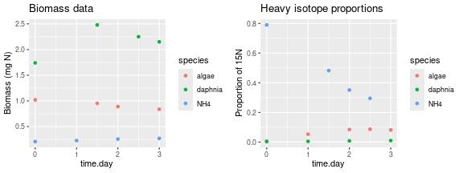
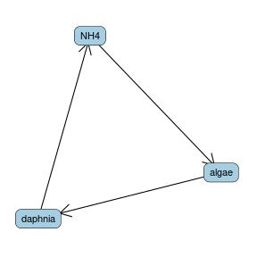
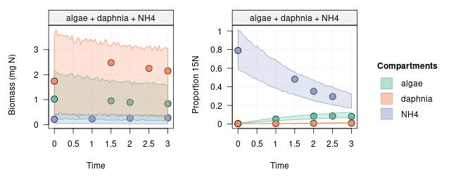

The first section below is a **quick overview** presenting the modelling approach used in the `isotracer` package. The second section is a **toy example** to illustrate the common steps used for every model run with `isotracer`.

## Overview: modelling of tracer experiments

**Tracer experiments** are used in ecosystem ecology to reconstruct nutrient flows in foodwebs. The basic idea is to add some isotopically-enriched nutrient (the **tracer**) to an ecosystem and track its fate through time across the foodweb compartments.

The `isotracer` package provides tools to analyze data from tracer experiments. It uses a Bayesian framework to **quantify** the nutrient fluxes between compartments and the **associated uncertainties** in a statistically rigorous way. It also allows to test the existence of speculative trophic links by comparing models with different foodweb topologies.

### The isotracer model in a nutshell

A foodweb is modelled as a **network** of compartments which are **connected** by trophic links, and through which nutrients flow from one compartment to the next. The basic assumption of the model used in `isotracer` is that the rate of transfer from a **source compartment** to a **destination compartment** is proportional to the size of the **source compartment** (i.e. it is analogous to a first-order reaction). This model is the only one currently implemented in `isotracer`, but the Bayesian framework used in the package could be extended to handle more complicated transfer kinetics.

For a detailed explanation of the statistical framework used by the package, you can read the original manuscript:

- López-Sepulcre, Andrés, Matthieu Bruneaux, Sarah M. Collins, Rana El-Sabaawi, Alexander S. Flecker, and Steven A. Thomas. **A New Method to Reconstruct Quantitative Food Webs and Nutrient Flows from Isotope Tracer Addition Experiments.** [Am. Nat. (2020)](https://www.journals.uchicago.edu/doi/10.1086/708546).

### What is needed to model a foodweb?

To estimate the coefficients for the transfer rates, the model needs three pieces of information:

1. the **topology** of the foodweb, defined by links between compartments such as *ammonium -> algae -> grazer*
2. the **initial conditions** at the beginning of the experiment (for each compartment: the total nutrient biomass and the proportion of marked nutrient).
3. the **observations** made during the experiment (for each compartment: a time series providing total nutrient biomass and proportion of marked nutrient at several time points).

Finally, a fourth piece of information might be needed to describe the experimental design of the tracer addition (but not always):

- If the tracer is added to one of the compartments at the **beginning** of the experiment, then specifying the **initial conditions** is enough to fully describe the experimental design of the addition - nothing else is needed.
- If the tracer is added later using a **pulse** or a **drip** addition, then the user must also specify the addition events when building the model since the initial conditions do not capture this addition.

In the next section, we describe the modelling of a toy model to illustrate the basic steps used when running a model with `isotracer`.

<div class="alert-primary" role="alert"> 

<b>Note:</b> There is a big difference between the way we fit models using e.g. `lm()` in base R and the way we fit models in `isotracer`: `lm()` models are **built** and **fitted** with a single call such as `lm(y ~ x, data = my_data)`, whereas network models are **built incrementally** in a series of steps and then **fitted using MCMC**. 

This incremental approach is due to the complexity of the information we need to provide the model. It also allows for a more finely tuned definition of the model.

</div>

## A toy example: a small aquarium

In this example, we model a very simple toy system: an aquarium containing dissolved ammonium (NH$_4^+$), planctonic algae and *Daphnia*. The algae assimilate NH$_4^+$, and the *Daphnia* graze on the algae.

Our focal nutrient is nitrogen (N): we want to quantify the nitrogen flows in the aquarium. We do this by adding some NH$_4^+$ enriched in the heavy isotope $^{15}$N at the beginning of the experiment. Note that we made up the numbers in this example, but they are useful to illustrate how the package works.

Let's load the package and get started!


```r
library(isotracer)
# We recommend to use several cores (if available) to speed-up calculations:
options(mc.cores = parallel::detectCores())
```

### The data


This is the data from a simulated experiment. You can copy-paste the code below to create the `exp` table in your own R session.


```r
library(tibble)
exp <- tibble::tribble(
  ~time.day,  ~species, ~biomass, ~prop15N,
          0,   "algae",     1.02,  0.00384,
          1,   "algae",       NA,   0.0534,
        1.5,   "algae",    0.951,       NA,
          2,   "algae",    0.889,   0.0849,
        2.5,   "algae",       NA,   0.0869,
          3,   "algae",    0.837,   0.0816,
          0, "daphnia",     1.74,  0.00464,
          1, "daphnia",       NA,  0.00493,
        1.5, "daphnia",     2.48,       NA,
          2, "daphnia",       NA,  0.00831,
        2.5, "daphnia",     2.25,       NA,
          3, "daphnia",     2.15,   0.0101,
          0,     "NH4",    0.208,     0.79,
          1,     "NH4",    0.227,       NA,
        1.5,     "NH4",       NA,    0.482,
          2,     "NH4",    0.256,    0.351,
        2.5,     "NH4",       NA,    0.295,
          3,     "NH4",     0.27,        NA
  )
```

Note that the data in the `exp` table contains some `NA` in the `biomass` and `prop15N` columns: like in a real life experiment, we don't always measure both biomass and isotope enrichment data at the same time in this simulated dataset.

Let's visualize the data. Below we use the `ggplot2` package to do that:


```r
library(ggplot2)
library(gridExtra)
p1 <- ggplot(exp, aes(x = time.day, y = biomass, col = species)) +
    geom_point() + ggtitle("Biomass data") + ylab("Biomass (mg N)")
p2 <- ggplot(exp, aes(x = time.day, y = prop15N, col = species)) +
    geom_point() + ggtitle("Heavy isotope proportions") + ylab("Proportion of 15N")
grid.arrange(p1, p2, ncol = 2)
```



As you can see, our simulated data is a time series over three days. For each species, we have measurements of total N biomass (left panel) and of the proportion of $^{15}$N in the N biomass (right panel).

The initial conditions are stored in the `exp` table along with the later observations. We can extract them by filtering the row for $t_0$:


```r
exp %>% filter(time.day == 0)
```

```
## # A tibble: 3 × 4
##   time.day species biomass prop15N
##      <dbl> <chr>     <dbl>   <dbl>
## 1        0 algae     1.02  0.00384
## 2        0 daphnia   1.74  0.00464
## 3        0 NH4       0.208 0.79
```

In this experiment we added the $^{15}$N-enriched ammonium at the very beginning of the experiment, as is reflected in the `prop15N` column (ammonium starts with a high proportion of $^{15}$N while the algae and *Daphnia* are close to background levels). Our experimental design is simple and does not include a tracer pulse or drip.

### Building the model, one step at a time

<div class="alert-primary" role="alert"> 

<b>Note:</b> In this example and in all later tutorials, we use the [pipe operator](https://magrittr.tidyverse.org/) `%>%` which you are probably familiar with if you have been using the [tidyverse](https://www.tidyverse.org/) packages. Of course, you can also use the isotracer functions without the pipe operator if you prefer!

</div>

We first create a new, empty network model that we will populate later with the data:


```r
m <- new_networkModel()
```

You might notice a message informing you about the default distribution family used for the modelling of proportions. We'll use the default distribution in this tutorial, but we'll learn later how to change it if needed.

What does our model object look like?


```r
m
```

```
## # A tibble: 0 × 3
## # ℹ 3 variables: topology <list>, initial <list>, observations <list>
```
 
At this stage, our model `m` is quite boring: it is completely empty! It is just a tibble with three columns but zero rows. The three columns are the minimum information we have to provide a network model before we can run it: a topology, initial conditions, and observations.

Let's first set the topology of the network we want to model:


```r
m <- m %>% set_topo("NH4 -> algae -> daphnia -> NH4")
```

The basic foodweb topology is `NH4 -> algae -> daphnia`, but since *Daphnia* excrete ammonium back into the aquarium water we also included the link `daphnia -> NH4`. Our topology basically describes the full nitrogen cycle in this simple case! What does our model object `m` contain at this stage?


```r
m
```

```
## # A tibble: 1 × 4
##   topology           initial observations parameters      
##   <list>             <list>  <list>       <list>          
## 1 <topology [3 × 3]> <NULL>  <NULL>       <tibble [8 × 2]>
```

Note how adding a topology to the model automatically created a `parameters` column. We'll see later that this contains the names of the parameters that the model will estimate, based on the topology that we provided. Other columns for which we did not provide any information yet are shown as `<NULL>`.

<div class="alert-primary" role="alert"> 

<b>Tip:</b> `isotracer` stores network topology as a matrix defining one-way connections between compartments. The topology of a model can be accessed with `topo()`:


```r
topo(m)
```

```
## <3 comps> 
##         algae daphnia NH4
## algae       0       0   1
## daphnia     1       0   0
## NH4         0       1   0
```

In this representation, **source compartments** are the **columns** and **destination compartments** are the **rows**. A one means that the source and destination compartments are connected.

If you have the [ggraph](https://cran.r-project.org/package=ggraph) package installed, you can quickly visualize the topology with `ggtopo()`:


```r
ggtopo(m)
```



</div>

After providing a topology, the second element we need to specify is the initial conditions. In this example and as we mentioned before, they are stored in the rows of the `exp` table for which time is 0 days. Let's extract them from the `exp` table:


```r
inits <- exp %>% filter(time.day == 0)
inits
```

```
## # A tibble: 3 × 4
##   time.day species biomass prop15N
##      <dbl> <chr>     <dbl>   <dbl>
## 1        0 algae     1.02  0.00384
## 2        0 daphnia   1.74  0.00464
## 3        0 NH4       0.208 0.79
```

and let's add them to our model with the `set_init()` function:


```r
# We specify the names of the columns containing the data
m <- m %>% set_init(inits, comp = "species", size = "biomass", prop = "prop15N")
m
```

```
## # A tibble: 1 × 4
##   topology           initial          observations parameters      
##   <list>             <list>           <list>       <list>          
## 1 <topology [3 × 3]> <tibble [3 × 3]> <NULL>       <tibble [8 × 2]>
```

As we can see above, our model now contains the initial conditions in its `initial` column.

Finally the last piece of information we need are the observations. Those are stored in the rows of the `exp` table for which time is $>0$ days:


```r
obs <- exp %>% filter(time.day > 0)
head(obs)
```

```
## # A tibble: 6 × 4
##   time.day species biomass  prop15N
##      <dbl> <chr>     <dbl>    <dbl>
## 1      1   algae    NA      0.0534 
## 2      1.5 algae     0.951 NA      
## 3      2   algae     0.889  0.0849 
## 4      2.5 algae    NA      0.0869 
## 5      3   algae     0.837  0.0816 
## 6      1   daphnia  NA      0.00493
```

We add the observations to the model with the `add_obs()` function:


```r
m <- m %>% set_obs(obs, time = "time.day")
m
```

```
## # A tibble: 1 × 4
##   topology           initial          observations      parameters      
##   <list>             <list>           <list>            <list>          
## 1 <topology [3 × 3]> <tibble [3 × 3]> <tibble [15 × 4]> <tibble [8 × 2]>
```

Neat! Our model is now complete! It has:

- a topology
- the initial conditions (which include the initial $^{15}$N enrichment for ammonium)
- some observations
- some automatically added parameters that will be estimated when we run the model.

### Running the model

Now that our model is fully specified, what are the parameters that are going to be fitted given our model topology?

Those parameters were automatically added to the model object in the `parameters` column, and we can get their names with the `params()` function:


```r
params(m)
```

```
## # A tibble: 8 × 2
##   in_model                 value
##   <chr>                    <dbl>
## 1 eta                         NA
## 2 lambda_algae                NA
## 3 lambda_daphnia              NA
## 4 lambda_NH4                  NA
## 5 upsilon_algae_to_daphnia    NA
## 6 upsilon_daphnia_to_NH4      NA
## 7 upsilon_NH4_to_algae        NA
## 8 zeta                        NA
```

Eight parameters are going to be estimated:

- The `upsilon_<source>_to_<dest>` parameters are the coefficients for the uptake rates from one compartment to the next.
- The `lambda_<source>` parameters are the coefficients for the loss rates for each compartment, i.e. nutrient which is lost from the network and does not go into any other compartment. In our experiment, since the aquarium is a closed system, we would expect those values to be 0 (we will learn in later tutorials how to actually set those values to 0 so that the model doesn't try to estimate them). 
- Finally, `eta` and `zeta` are the coefficients of variation for the predicted tracer proportions and biomasses, respectively. They allow for the "noise" of the observed values around the predicted values.

Since we are using a Bayesian approach, each parameter must have a prior associated with it. 

<div class="alert-primary" role="alert">

While many packages implementing Bayesian methods provide default priors, we made the conscious decision to **not provide default priors** with `isotracer`.

We think this is a good way to encourage users to make reasoned, explicit choices about their priors, rather than trusting blindly some default priors that might be woefully inappropriate to the system being modelled.

The package loses a bit in user-friendliness, but this is outweighed by the greater benefit of choosing priors which are sensible for the particular modelling task at hand rather than obtaining wrong results from relying on poor prior defaults.

</div>

The current priors can be accessed with the `priors()` function, and for now they are al set to `NULL`:


```r
priors(m)
```

```
## # A tibble: 8 × 2
##   in_model                 prior 
##   <chr>                    <list>
## 1 eta                      <NULL>
## 2 lambda_algae             <NULL>
## 3 lambda_daphnia           <NULL>
## 4 lambda_NH4               <NULL>
## 5 upsilon_algae_to_daphnia <NULL>
## 6 upsilon_daphnia_to_NH4   <NULL>
## 7 upsilon_NH4_to_algae     <NULL>
## 8 zeta                     <NULL>
```

We will learn in a [later tutorial](tutorial-060-units-priors.html) how to customize priors more in depth, and there will also be advices about how to set priors throughout the tutorials. Here we will just quickly set them to something reasonable for this particular model:


```r
m <- m %>%
  set_priors(normal_p(0, 5), "lambda|upsilon") %>%
  set_priors(normal_p(0, 2), "eta")
priors(m)
```

```
## # A tibble: 8 × 2
##   in_model                 prior                     
##   <chr>                    <list>                    
## 1 eta                      <trun_normal(mean=0,sd=2)>
## 2 lambda_algae             <trun_normal(mean=0,sd=5)>
## 3 lambda_daphnia           <trun_normal(mean=0,sd=5)>
## 4 lambda_NH4               <trun_normal(mean=0,sd=5)>
## 5 upsilon_algae_to_daphnia <trun_normal(mean=0,sd=5)>
## 6 upsilon_daphnia_to_NH4   <trun_normal(mean=0,sd=5)>
## 7 upsilon_NH4_to_algae     <trun_normal(mean=0,sd=5)>
## 8 zeta                     <trun_normal(mean=0,sd=2)>
```

Good. At this stage, everything is ready to fit the model, or in other words to sample the parameter posteriors using MCMC. We run the MCMC with the `runMCMC()` function:


```r
run <- run_mcmc(m, iter = 1000)
```

We can examine the chains and the posterior distributions of the parameters by plotting the run output:


```r
plot(run)
# Note: the figure below only shows a few of the traceplots for vignette concision
```


We can get some numerical estimates from those posteriors with the `summary()` function:


```r
summary(run)
```

```
## 
## Iterations = 501:1000
## Thinning interval = 1 
## Number of chains = 4 
## Sample size per chain = 500 
## 
## 1. Empirical mean and standard deviation for each variable,
##    plus standard error of the mean:
## 
##                             Mean       SD  Naive SE Time-series SE
## eta                      0.12751 0.049964 0.0011172      0.0019548
## lambda_algae             0.10723 0.067599 0.0015116      0.0021817
## lambda_daphnia           0.03647 0.042346 0.0009469      0.0015642
## lambda_NH4               0.09269 0.068981 0.0015425      0.0027648
## upsilon_algae_to_daphnia 0.07785 0.023643 0.0005287      0.0009433
## upsilon_daphnia_to_NH4   0.04894 0.007169 0.0001603      0.0002337
## upsilon_NH4_to_algae     0.34347 0.045724 0.0010224      0.0017310
## zeta                     0.43612 0.237678 0.0053146      0.0099599
## 
## 2. Quantiles for each variable:
## 
##                               2.5%      25%     50%     75%   97.5%
## eta                      0.0654264 0.094176 0.11691 0.14817 0.25969
## lambda_algae             0.0085454 0.057541 0.09705 0.14604 0.26499
## lambda_daphnia           0.0007375 0.009573 0.02209 0.04620 0.15846
## lambda_NH4               0.0034180 0.041621 0.07744 0.13014 0.26348
## upsilon_algae_to_daphnia 0.0451278 0.062348 0.07370 0.08860 0.13730
## upsilon_daphnia_to_NH4   0.0361709 0.044109 0.04849 0.05325 0.06439
## upsilon_NH4_to_algae     0.2609275 0.314829 0.34115 0.37062 0.43671
## zeta                     0.1844365 0.286386 0.36440 0.51207 1.09344
```

Finally, doing a **posterior predictive check** where we compare the observations and the corresponding predicted 95% credible intervals is a good way to check that the chosen model makes sense for this dataset:


```r
predictions <- predict(m, run, probs = 0.95)
plot(predictions, ylab.size = "Biomass (mg N)", ylab.prop = "Proportion 15N")
```



We would expect 95% of the observations to fall within the predicted 95% credible intervals if the model is appropriate to describe the dataset.

Congratulations! You have just fitted your first model with `isotracer`! In the next tutorial, we will learn about how to handle replication in the dataset.


<nav aria-label="Page navigation">
 <ul class="pagination justify-content-end">
  <li class="page-item">(No previous tutorial)</li>
  <li class="page-item"><a class="page-link" href="tutorial-020-replication.html">Next: Handling replication</a></li>
 </ul>
</nav>

