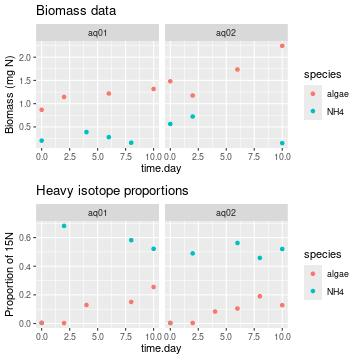
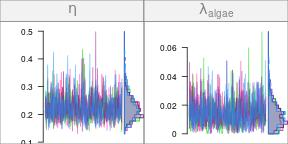
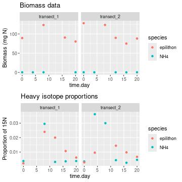
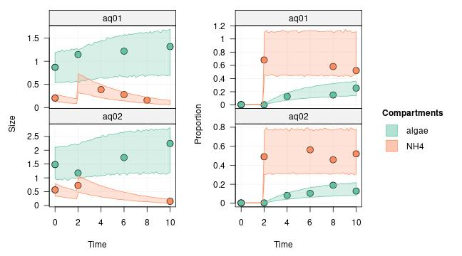

In tracer addition experiments, the enriched tracer is typically added in one of two ways: either at the very beginning of the experiment (and then left unmanipulated during the rest of the experiment), or through one or several pulses or continuous drips.

In the first case, the corresponding network model can be specified by using appropriate initial conditions as we have seen in the previous tutorials (and steady-state compartments can be used if needed). In the second case, we need to explicitly define the pulse and drip events in the model.

In this tutorial, you will learn how to define **pulse** and **drip events** for your network model. The first section will teach you how to define pulse events, and the second how to define drip events.


```r
library(isotracer)
library(tidyverse)
```


## Modelling pulse events


### Data preparation

The simulated data we use in this example can be loaded into your R session by running the code below:


```r
exp <- tibble::tribble(
  ~time.day, ~species, ~biomass, ~prop15N, ~aquariumID,
          0,    "NH4",   0.2054,   0.0045,      "aq01",
          2,    "NH4",       NA,   0.6815,      "aq01",
          4,    "NH4",   0.3883,       NA,      "aq01",
          6,    "NH4",   0.2804,       NA,      "aq01",
          8,    "NH4",   0.1604,   0.5817,      "aq01",
         10,    "NH4",       NA,   0.5216,      "aq01",
          0,  "algae",   0.8691,   0.0043,      "aq01",
          2,  "algae",   1.1449,   0.0029,      "aq01",
          4,  "algae",       NA,   0.1293,      "aq01",
          6,  "algae",   1.2182,       NA,      "aq01",
          8,  "algae",       NA,   0.1507,      "aq01",
         10,  "algae",   1.3169,   0.2549,      "aq01",
          0,    "NH4",   0.5637,   0.0035,      "aq02",
          2,    "NH4",   0.7241,   0.4896,      "aq02",
          6,    "NH4",       NA,   0.5623,      "aq02",
          8,    "NH4",       NA,   0.4578,      "aq02",
         10,    "NH4",   0.1515,   0.5202,      "aq02",
          0,  "algae",   1.4809,   0.0039,      "aq02",
          2,  "algae",   1.1758,   0.0041,      "aq02",
          4,  "algae",       NA,   0.0833,      "aq02",
          6,  "algae",   1.7349,    0.105,      "aq02",
          8,  "algae",       NA,   0.1899,      "aq02",
         10,  "algae",   2.2429,   0.1281,      "aq02"
  )
```

In this simulated experiment, we have two replicated aquariums in which there is dissolved ammonium and some planctonic algae that assimilates it. We trace the nitrogen fluxes by using $^{15}$N. However, instead of adding $^{15}$N-enriched ammonium at the beginning of the experiment, we add it as a pulse after two days.

Let's have a look at the data:


```r
library(ggplot2)
library(gridExtra)
p1 <- ggplot(exp, aes(x = time.day, y = biomass, col = species)) +
    geom_point() + ggtitle("Biomass data") + ylab("Biomass (mg N)") +
    facet_wrap(~ aquariumID)
p2 <- ggplot(exp, aes(x = time.day, y = prop15N, col = species)) +
    geom_point() + ggtitle("Heavy isotope proportions") + ylab("Proportion of 15N")  +
    facet_wrap(~ aquariumID)
grid.arrange(p1, p2, nrow = 2)
```



### Building the network model

The model topology is very simple:


```r
m <- new_networkModel() %>% set_topo("NH4 -> algae")
```

The initial conditions are taken from the `exp` table for $t=t_0$:


```r
inits <- exp %>% filter(time.day == 0)
```

We set the initial conditions in the model:


```r
m <- m %>% set_init(inits, comp = "species", size = "biomass", prop = "prop15N",
                    group_by = "aquariumID")
```

And we use all the rows from the `exp` table for which $t>t_0$ as the observations:


```r
obs <- exp %>% filter(time.day > 0)
m <- m %>% set_obs(obs, time = "time.day")
m
```

```
## # A tibble: 2 × 5
##   topology           initial          observations      parameters       group    
##   <list>             <list>           <list>            <list>           <list>   
## 1 <topology [2 × 2]> <tibble [2 × 3]> <tibble [10 × 4]> <tibble [5 × 2]> <chr [1]>
## 2 <topology [2 × 2]> <tibble [2 × 3]> <tibble [9 × 4]>  <tibble [5 × 2]> <chr [1]>
```

Now the only missing information before running the MCMC is the pulse event that was used during the experiment.

### Specifying a pulse event

A pulse event is defined as a discrete addition of material into one compartment. It is specified in a network model with the `add_pulse_event()` function. 

The arguments needed to define a pulse event are:

- the time at which the pulse event took place
- the compartment(s) in which the pulse was added
- the amount of unmarked material added (e.g. $^{14}$N)
- the amount of marked material added (e.g. $^{15}$N))
- optionally, the replicates in which the pulse took place (by default all replicates are affected by the pulse, which is duplicated as many times as needed).

In our example, the pulse event is an addition of pure $^{15}$N-ammonium. The equivalent of 0.4 mg $^{15}$N were added to each aquarium at $t=2$ days. We specify this pulse event in the model with:


```r
m <- m %>% add_pulse_event(time = 2, comp = "NH4", unmarked = 0, marked = 0.4)
```

and we can see that the model now contains some addition events in the `events` columns:


```r
m
```

```
## # A tibble: 2 × 6
##   topology           initial          observations      parameters group     events  
##   <list>             <list>           <list>            <list>     <list>    <list>  
## 1 <topology [2 × 2]> <tibble [2 × 3]> <tibble [10 × 4]> <tibble>   <chr [1]> <tibble>
## 2 <topology [2 × 2]> <tibble [2 × 3]> <tibble [9 × 4]>  <tibble>   <chr [1]> <tibble>
```

```r
m$events
```

```
## [[1]]
## # A tibble: 1 × 4
##   event  time compartment characteristics 
##   <chr> <dbl> <chr>       <list>          
## 1 pulse     2 NH4         <named list [2]>
## 
## [[2]]
## # A tibble: 1 × 4
##   event  time compartment characteristics 
##   <chr> <dbl> <chr>       <list>          
## 1 pulse     2 NH4         <named list [2]>
```

### Running the MCMC

The rest of the model fitting works as usual. We quickly set some reasonable priors for the particular model at hand:


```r
m <- set_priors(m, normal_p(0, 4), "")
priors(m)
```

```
## # A tibble: 5 × 2
##   in_model             prior                     
##   <chr>                <list>                    
## 1 eta                  <trun_normal(mean=0,sd=4)>
## 2 lambda_algae         <trun_normal(mean=0,sd=4)>
## 3 lambda_NH4           <trun_normal(mean=0,sd=4)>
## 4 upsilon_NH4_to_algae <trun_normal(mean=0,sd=4)>
## 5 zeta                 <trun_normal(mean=0,sd=4)>
```

We run the MCMC and check the traces:


```r
run <- run_mcmc(m, iter = 1000)
plot(run)
# Note: the figure below only shows a few of the traceplots for vignette concision
```



Let's have a quick look at the posterior predictive check:


```r
predictions <- predict(m, run)
plot(predictions, facet_row = "group")
```


The effect of the pulse is clearly visible in the proportion of marked tracer, both for ammonium and for algae (right panel). The pulse is also visible as an increase in the predicted ammonium compartment size (left panel)).

## Modelling drip events

Drip events are different from pulse events: while a pulse is a one-time, discrete addition of tracer, a drip is a continuous addition taking place over a time interval.


### Data preparation

The simulated data we use in this example can be loaded into your R session by running the code below:


```r
exp <- tibble::tribble(
  ~time.day,    ~species, ~biomass, ~prop15N,    ~transect,
          0,       "NH4",    0.313,   0.0038, "transect_1",
          4,       "NH4",   0.2746,       NA, "transect_1",
          8,       "NH4",   0.3629,   0.0295, "transect_1",
         12,       "NH4",       NA,   0.0032, "transect_1",
         16,       "NH4",       NA,   0.0036, "transect_1",
         20,       "NH4",   0.3414,   0.0038, "transect_1",
          0, "epilithon",  89.2501,   0.0022, "transect_1",
          8, "epilithon", 123.1212,    0.024, "transect_1",
         12, "epilithon",       NA,     0.02, "transect_1",
         16, "epilithon",  90.5919,   0.0107, "transect_1",
         20, "epilithon",  80.3261,   0.0062, "transect_1",
          0,       "NH4",   0.3525,   0.0035, "transect_2",
          4,       "NH4",   0.2958,   0.0362, "transect_2",
          8,       "NH4",       NA,     0.03, "transect_2",
         12,       "NH4",   0.3392,   0.0044, "transect_2",
         16,       "NH4",    0.212,   0.0026, "transect_2",
         20,       "NH4",   0.3818,   0.0046, "transect_2",
          0, "epilithon",  127.873,   0.0029, "transect_2",
          4, "epilithon",       NA,   0.0096, "transect_2",
          8, "epilithon", 123.3216,       NA, "transect_2",
         12, "epilithon",  89.8053,   0.0144, "transect_2",
         16, "epilithon",  74.9105,   0.0098, "transect_2",
         20, "epilithon",  88.0108,   0.0067, "transect_2"
  )
```

In this simulated experiment, we are studying a stream at two dfferent locations (transects 1 and 2) and we are measuring nitrogen flow between dissolved NH$_4^+$ and algae on the stream bed (`epilithon`). Since the water is flowing continuously in the stream, we will consider the ammonium as a steady-state compartment (see the [tutorial](tutorial-030-steady-state-comps.html) about steady state compartments).

The design of that experiment is that we start with two days of measurements during which no addition is performed, then a continuous drip of $^{15}$N-ammonium is performed between day 2 and day 10, and then the drip is stopped and we continue measurements until day 20. We will see below how to tell the model about the drip setup.

First let's have a look at the data:


```r
library(ggplot2)
library(gridExtra)
p1 <- ggplot(exp, aes(x = time.day, y = biomass, col = species)) +
    geom_point() + ggtitle("Biomass data") + ylab("Biomass (mg N)") +
    facet_wrap(~ transect)
p2 <- ggplot(exp, aes(x = time.day, y = prop15N, col = species)) +
    geom_point() + ggtitle("Heavy isotope proportions") + ylab("Proportion of 15N")  +
    facet_wrap(~ transect)
grid.arrange(p1, p2, nrow = 2)
```



### Building the model

We define the model topology:


```r
m <- new_networkModel() %>% set_topo("NH4 -> epilithon")
```

The initial conditions are taken from the `exp` table for $t=t_0$:


```r
inits <- exp %>% filter(time.day == 0)
```

We set the initial conditions in the model:


```r
m <- m %>% set_init(inits, comp = "species", size = "biomass", prop = "prop15N",
                    group_by = "transect")
```

And we use all the rows from the `exp` table for which $t>t_0$ as the observations:


```r
obs <- exp %>% filter(time.day > 0)
m <- m %>% set_obs(obs, time = "time.day")
```

```
## Using the same columns by default as the ones used with `set_init()`:
##   comp = "species"
##   size = "biomass"
##   prop = "prop15N"
##   group_by = "transect"
```

```r
m
```

```
## # A tibble: 2 × 5
##   topology           initial          observations      parameters       group    
##   <list>             <list>           <list>            <list>           <list>   
## 1 <topology [2 × 2]> <tibble [2 × 3]> <tibble [9 × 4]>  <tibble [5 × 2]> <chr [1]>
## 2 <topology [2 × 2]> <tibble [2 × 3]> <tibble [10 × 4]> <tibble [5 × 2]> <chr [1]>
```

Finally, we tell the model that the NH$_4^+$ compartment is to be considered as a steady-state compartment since it is continuously renewed by the stream flow:


```r
m <- m %>% set_steady(comps = "NH4")
```

Now the only missing information before running the MCMC is the drip event that was applied during the experiment.

### Specifying a drip event

For now, `isotracer` only allows to specify drip events for steady-state compartments.

<div class="alert-primary" role="alert"> 

<b>Technical note if you are curious about the implementation:</b> The numerical solving of the differential equations governing a network model is implemented so that at each discrete time step $dt$, the following operations are performed (in that order):

- calculate the transfer of material based on uptake and loss rates
- regenerate steady-state compartments to their previous state
- add material defined in pulse events, if any such event occurs at this time step.

We can thus define a drip event for a steady-state compartment by adding two pulse events with `add_pulse_event()`, one "on" event and one "off" event.
</div>

In the simulated experiment, the drip upstream of each transect increased the amount of $^{15}$N in the dissolved ammonium by 0.008 mg N/m$^2$.

We define the "on" event of the drip by a corresponding pulse:


```r
m <- m %>%
    add_pulse_event(time = 2, comp = "NH4", unmarked = 0, marked = 0.008)
```

Because NH$_4^+$ is set to "steady state", the pulse event will actually be equivalent to changing the original steady state to a different steady state.

Similarly, we define the "off" event of the drip by an opposite pulse in which we **remove** 0.008 mg N/m$^2$ in the steady-state compartment:


```r
m <- m %>%
    add_pulse_event(time = 10, comp = "NH4", unmarked = 0, marked = -0.008)
```

Again, since NH$_4^+$ is set to steady-state, those two pulses will result in a step-like profile with an increased amount of $^{15}$N during the drip phase.

Let's look at the events in the `events` column of the model:


```r
m$events
```

```
## [[1]]
## # A tibble: 2 × 4
##   event  time compartment characteristics 
##   <chr> <dbl> <chr>       <list>          
## 1 pulse     2 NH4         <named list [2]>
## 2 pulse    10 NH4         <named list [2]>
## 
## [[2]]
## # A tibble: 2 × 4
##   event  time compartment characteristics 
##   <chr> <dbl> <chr>       <list>          
## 1 pulse     2 NH4         <named list [2]>
## 2 pulse    10 NH4         <named list [2]>
```

Two events were succesfully registered for each replicate.

<div class="alert-primary" role="alert"> 
Note that in a real life experiment, the increase in tracer quantities resulting from a drip would depend on several factors, such as the drip rate, the stream discharge, the distance between the drip and the focal transect, etc... A reasonable way to obtain the increased value would be to average several measurements of dissolved ammonium concentration and ammonium $\delta^{15}N$ obtained over the drip phase at each transect location, and calculate from them the corresponding increase in tracer quantities in mg N/m$^2$. Different increases can be specified for each transect, but for simplicity we consider similar increase values across both transects in our example above.
</div>

### Running the MCMC

The rest of the model fitting works as usual. The parameters and their default priors are:


```r
priors(m)
```

```
## # A tibble: 5 × 2
##   in_model                 prior 
##   <chr>                    <list>
## 1 eta                      <NULL>
## 2 lambda_epilithon         <NULL>
## 3 lambda_NH4               <NULL>
## 4 upsilon_NH4_to_epilithon <NULL>
## 5 zeta                     <NULL>
```

We run the MCMC and check the traces:


```r
run <- run_mcmc(m, iter = 1000)
plot(run)
# Note: the figure below only shows a few of the traceplots for vignette concision
```


```
## Error in encode_priors(params_nm, priors_nm): One or several parameters are missing a prior.
## You can list the current model priors with `priors(...)`.
## You can list the missing model priors with `missing_priors(...)`.
```


Let's have a quick look at the posterior predictive check:


```r
predictions <- predict(m, run)
plot(predictions, facet_row = "group")
```


```
## Error in `purrr::map()`:
## ℹ In index: 1.
## Caused by error in `project()`:
## ! !any(is.na(params$value)) is not TRUE
```



Nice! The drip phase is clearly visible in the NH$_4^+$ enrichment profile.

This was the last tutorial focusing on specifying the experimental design of an addition experiment. The next tutorials will focus on **statistical aspects** of the model, such as incorporating the effects of covariates and choosing parameter priors.

<nav aria-label="Page navigation">
 <ul class="pagination justify-content-end">
  <li class="page-item"><a class="page-link" href="tutorial-030-steady-state-comps.html">Previous: Setting steady-state compartments</a></li>
  <li class="page-item"><a class="page-link" href="tutorial-050-fixed-effects.html">Next: Fixed effects of covariates</a></li>
 </ul>
</nav>
