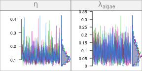
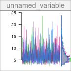
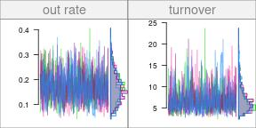
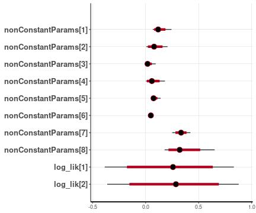

In this tutorial, we will have a closer look at the object returned by calling `run_mcmc()` on a network model. Understanding the structure of the object containing the results of a run is important for model diagnostics and interpretation.

## The default format: mcmc.list

To quickly obtain an MCMC run output for us to examine, let's run the simple model `aquarium_mod` which is provided with the package. Feel free to read the help `?aquarium_mod` if you are curious about the model itself.


```r
library(isotracer)
aquarium_mod
fit <- run_mcmc(aquarium_mod, iter = 1000)
```


By default, `run_mcmc()` returns an `mcmc.list` object. An `mcmc.list` has a simple format to store the content of parallel MCMC chains:


```r
length(fit)
```

```
## [1] 4
```

```r
str(fit[[1]])
```

```
##  'mcmc' num [1:500, 1:8] 0.139 0.19 0.163 0.197 0.164 ...
##  - attr(*, "dimnames")=List of 2
##   ..$ : NULL
##   ..$ : chr [1:8] "eta" "lambda_algae" "lambda_daphnia" "lambda_NH4" ...
##  - attr(*, "mcpar")= num [1:3] 501 1000 1
```

The output above can seem a little obscure if you are not familiar with R data structures, but in a nutshell it tells us that the `mcmc.list` is basically a list with one element per chain, each chain being stored as a matrix.

The `mcmc.list` class is implemented by the [coda](https://cran.r-project.org/package=coda) package, and it has the advantage of being recognized by many other R packages dealing with Bayesian MCMC such as **bayesplot** of **ggmcmc**.

In the **isotracer** package, the returned `fit` is very slightly extended compared to the base `mcmc.list` class:


```r
class(fit)
```

```
## [1] "networkModelStanfit" "mcmc.list"
```

By having also a `networkModelStanfit` class, the output from `run_mcmc()` can be recognized automatically by some methods implemented in **isotracer**, such as `plot()`:


```r
plot(fit)
# Note: the figure below only shows a few of the traceplots for vignette concision
```



### How to convert the default output to a table?

An `mcmc.list` object can be converted to an even simpler, flat matrix:


```r
z <- as.matrix(fit)
head(z)
```

```
##            eta lambda_algae lambda_daphnia lambda_NH4 upsilon_algae_to_daphnia
## [1,] 0.1388709   0.07081796    0.025593596 0.09396715               0.09958580
## [2,] 0.1904065   0.07192057    0.028120887 0.04813799               0.08037595
## [3,] 0.1625200   0.09480659    0.058425488 0.08378287               0.06431398
## [4,] 0.1970115   0.12314793    0.011265605 0.18970227               0.11141167
## [5,] 0.1639239   0.15948200    0.009692098 0.21106388               0.09964886
## [6,] 0.1368046   0.22078933    0.008393745 0.13363175               0.09573631
##      upsilon_daphnia_to_NH4 upsilon_NH4_to_algae      zeta
## [1,]             0.04127811            0.3031734 0.2867592
## [2,]             0.04224113            0.3556842 0.4337270
## [3,]             0.04083699            0.3181253 0.6070085
## [4,]             0.04253740            0.2923228 0.5730571
## [5,]             0.04495138            0.2986779 0.4918875
## [6,]             0.04213412            0.2952007 0.4537903
```

```r
str(z)
```

```
##  num [1:2000, 1:8] 0.139 0.19 0.163 0.197 0.164 ...
##  - attr(*, "dimnames")=List of 2
##   ..$ : NULL
##   ..$ : chr [1:8] "eta" "lambda_algae" "lambda_daphnia" "lambda_NH4" ...
```

or to a data frame:


```r
z <- as.data.frame(as.matrix(fit))
head(z)
```

```
##         eta lambda_algae lambda_daphnia lambda_NH4 upsilon_algae_to_daphnia
## 1 0.1388709   0.07081796    0.025593596 0.09396715               0.09958580
## 2 0.1904065   0.07192057    0.028120887 0.04813799               0.08037595
## 3 0.1625200   0.09480659    0.058425488 0.08378287               0.06431398
## 4 0.1970115   0.12314793    0.011265605 0.18970227               0.11141167
## 5 0.1639239   0.15948200    0.009692098 0.21106388               0.09964886
## 6 0.1368046   0.22078933    0.008393745 0.13363175               0.09573631
##   upsilon_daphnia_to_NH4 upsilon_NH4_to_algae      zeta
## 1             0.04127811            0.3031734 0.2867592
## 2             0.04224113            0.3556842 0.4337270
## 3             0.04083699            0.3181253 0.6070085
## 4             0.04253740            0.2923228 0.5730571
## 5             0.04495138            0.2986779 0.4918875
## 6             0.04213412            0.2952007 0.4537903
```

```r
str(z)
```

```
## 'data.frame':	2000 obs. of  8 variables:
##  $ eta                     : num  0.139 0.19 0.163 0.197 0.164 ...
##  $ lambda_algae            : num  0.0708 0.0719 0.0948 0.1231 0.1595 ...
##  $ lambda_daphnia          : num  0.02559 0.02812 0.05843 0.01127 0.00969 ...
##  $ lambda_NH4              : num  0.094 0.0481 0.0838 0.1897 0.2111 ...
##  $ upsilon_algae_to_daphnia: num  0.0996 0.0804 0.0643 0.1114 0.0996 ...
##  $ upsilon_daphnia_to_NH4  : num  0.0413 0.0422 0.0408 0.0425 0.045 ...
##  $ upsilon_NH4_to_algae    : num  0.303 0.356 0.318 0.292 0.299 ...
##  $ zeta                    : num  0.287 0.434 0.607 0.573 0.492 ...
```

or to a tibble:


```r
z <- tibble::as_tibble(as.matrix(fit))
z
```

```
## # A tibble: 2,000 × 8
##       eta lambda_algae lambda_daphnia lambda_NH4 upsilon_algae_to_daphnia
##     <dbl>        <dbl>          <dbl>      <dbl>                    <dbl>
##  1 0.139        0.0708        0.0256      0.0940                   0.0996
##  2 0.190        0.0719        0.0281      0.0481                   0.0804
##  3 0.163        0.0948        0.0584      0.0838                   0.0643
##  4 0.197        0.123         0.0113      0.190                    0.111 
##  5 0.164        0.159         0.00969     0.211                    0.0996
##  6 0.137        0.221         0.00839     0.134                    0.0957
##  7 0.0963       0.199         0.120       0.133                    0.0724
##  8 0.0729       0.0443        0.00226     0.0916                   0.0598
##  9 0.103        0.0577        0.0593      0.134                    0.0809
## 10 0.144        0.199         0.0214      0.156                    0.0647
## # ℹ 1,990 more rows
## # ℹ 3 more variables: upsilon_daphnia_to_NH4 <dbl>, upsilon_NH4_to_algae <dbl>,
## #   zeta <dbl>
```

### How to calculate derived parameters?

Converting your output to one of those simple tabular formats can be useful if you want to manipulate and perform operations on your MCMC samples.

However, for simple manipulations, `isotracer` provides convenient methods to perform calculations on parameter chains directly from the output of `run_mcmc()`. You can thus produce derived parameter chains directly from the `mcmc.list` object, without having to convert your output to another format:


```r
algal_total_out <- fit[, "upsilon_algae_to_daphnia"] + fit[, "lambda_algae"]
algal_turnover <- 1 / algal_total_out
plot(algal_turnover)
```



You can read more about this in the vignette about [calculating derived parameters](tutorial-110-derived-parameters.html).

### How to combine derived parameters?

You can combine derived parameters into a single `mcmc.list`object using the usual `c()` syntax. This can be convenient for more compact plotting or summary calculations:


```r
my_derived <- c("out rate" = algal_total_out, "turnover" = algal_turnover)
plot(my_derived)
```



```r
summary(my_derived)
```

```
## 
## Iterations = 501:1000
## Thinning interval = 1 
## Number of chains = 4 
## Sample size per chain = 500 
## 
## 1. Empirical mean and standard deviation for each variable,
##    plus standard error of the mean:
## 
##            Mean      SD Naive SE Time-series SE
## out rate 0.1667 0.05938 0.001328       0.001919
## turnover 6.9191 2.89703 0.064779       0.124295
## 
## 2. Quantiles for each variable:
## 
##             2.5%    25%    50%   75%   97.5%
## out rate 0.06913 0.1224 0.1615 0.207  0.2965
## turnover 3.37231 4.8310 6.1929 8.172 14.4653
```

## A more detailed format: stanfit

Calling `run_mcmc()` will run a Stan model behind the scenes. Stan is great since it will let you know loudly when something went wrong with the run, such as problems with divergent chains or low Bayesian fraction of missing information. **Such problems should not be ignored!** The Stan development team has a [nice page explaining Stan's warnings](https://mc-stan.org/misc/warnings.html).

In any case, if something went wrong with your run, you might want to have a more complete output than simply the `mcmc.list` object. You can ask `run_mcmc()` to return the original `stanfit` object produced by Stan with:


```r
fit2 <- run_mcmc(aquarium_mod, iter = 1000, stanfit = TRUE)
```


`fit2` is now a regular `stanfit` object:


```r
class(fit2)
```

```
## [1] "stanfit"
## attr(,"package")
## [1] "rstan"
```

This is a more complicated type of object than an `mcmc.list`, but it also contains much more information about the Stan run. It also comes with the benefit of the existing methods for `stanfit` object, for example:


```r
rstan::plot(fit2)
```



You can go through [Stan documentation](https://mc-stan.org/rstan/reference/stanfit-class.html) for more details about this format. If you are reading about solving Stan model issues on online forums and the suggested solutions require to examine some Stan output, that's the object you want to look at!

For example, you can examine it with ShinyStan:


```r
library(shinystan)
launch_shinystan(fit2)
```

<div class="alert-primary" role="alert"> 

Note that with the current version of **isotracer** the parameters are indexed but not named in the `stanfit` object. That is something that will probably be improved in the future!

</div>

<nav aria-label="Page navigation">
 <ul class="pagination justify-content-end">
  <li class="page-item"><a class="page-link" href="tutorial-060-units-priors.html">Previous: Units and priors</a></li>
  <li class="page-item"><a class="page-link" href="tutorial-090-post-run-analyses.html">Next: Post-run diagnostics and analyses</a></li>
 </ul>
</nav>
