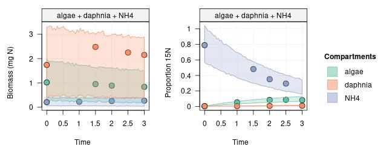
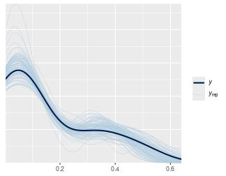
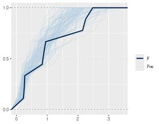
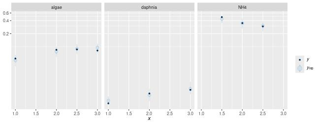
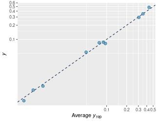

This tutorial explains how to check that the fitted model is compatible with the observed data. Basically, we predict the data we would expect based on the model posterior, and we compare it with the actually observed data to see if they are consistent.

Posterior predictive checks are important to ensure that the model makes sense to explain the observed data. Typically, before doing a posterior predictive check, one would check that the MCMC run was successful and that no problem arised during the MCMC itself (see the previous vignette about [Post-run diagnostics](tutorial-090-post-run-analyses.html)).


```r
library(isotracer)
library(tidyverse)
```


## Preparation

To illustrate posterior predictive checks, we will use the same simulated data as in the [Quick Start](tutorial-010-quick-start.html) tutorial:


```r
exp <- tibble::tribble(
  ~time.day,  ~species, ~biomass, ~prop15N,
          0,   "algae",     1.02,  0.00384,
          1,   "algae",       NA,   0.0534,
        1.5,   "algae",    0.951,       NA,
          2,   "algae",    0.889,   0.0849,
        2.5,   "algae",       NA,   0.0869,
          3,   "algae",    0.837,   0.0816,
          0, "daphnia",     1.74,  0.00464,
          1, "daphnia",       NA,  0.00493,
        1.5, "daphnia",     2.48,       NA,
          2, "daphnia",       NA,  0.00831,
        2.5, "daphnia",     2.25,       NA,
          3, "daphnia",     2.15,   0.0101,
          0,     "NH4",    0.208,     0.79,
          1,     "NH4",    0.227,       NA,
        1.5,     "NH4",       NA,    0.482,
          2,     "NH4",    0.256,    0.351,
        2.5,     "NH4",       NA,    0.295,
          3,     "NH4",     0.27,        NA
  )

# Separate initial conditions and observations
inits <- exp %>% filter(time.day == 0)
obs <- exp %>% filter(time.day > 0)

# Build the network model
mod <- new_networkModel() %>%
  set_topo("NH4 -> algae -> daphnia -> NH4") %>%
  set_init(inits, comp = "species", size = "biomass", prop = "prop15N") %>%
  set_obs(obs, time = "time.day")
```

```
## Using default distribution family for proportions ("gamma_cv").
```

```
##   (eta is the coefficient of variation of gamma distributions.)
```

```
## Using default distribution family for sizes ("normal_cv").
```

```
##   (zeta is the coefficient of variation of normal distributions.)
```

```
## Using the same columns by default as the ones used with `set_init()`:
##   comp = "species"
##   size = "biomass"
##   prop = "prop15N"
```

```r
# Set reasonable but vague priors for this model
mod <- set_priors(mod, normal_p(0, 5))
```

```
## Prior modified for parameter(s): 
##   - eta
##   - lambda_algae
##   - lambda_daphnia
##   - lambda_NH4
##   - upsilon_algae_to_daphnia
##   - upsilon_daphnia_to_NH4
##   - upsilon_NH4_to_algae
##   - zeta
```

We run the MCMC sampler to fit the model:


```r
fit <- run_mcmc(mod, iter = 1000)
plot(fit)
# Note: the figure below only shows a few of the traceplots for vignette concision
```


## Posterior predictive check

A posterior predictive check is the comparison between what the fitted model predicts and the actual observed data. The aim is to detect if the model is inadequate to describe the data.

### Trajectories prediction

The fastest and simplest way to perform a posterior predictive check for a network model is to predict the trajectories of the compartment sizes and proportions of marked material, and compare it with the data points. This is what we did in previous tutorials:


```r
predictions <- mod %>% predict(fit, probs = 0.95)
plot(predictions, ylab.size = "Biomass (mg N)", ylab.prop = "Proportion 15N")
```



We would expect 95% of the observations to fall within the predicted 95% credible intervals if the model is appropriate to describe the dataset.

### Tidy posterior predictions

If you want a finer control of the posterior predictive checks, you can obtain tidy posterior predictions with `tidy_dpp()`. Tidy posterior predictions are convenient if you want to perform some custom checks or examine some predictions in particular. Additionally, the output from `tidy_dpp()` can be used with the functions provided by the **bayesplot** package for [posterior predictive checks](https://mc-stan.org/bayesplot/reference/PPC-overview.html).

Posterior predictive checks rely on three objects:

- `y`: the observed data (a vector with $N$ observations)
- `y_rep`: the predicted data (a $D \times N$ matrix, where $D$ is the number of posterior draws from which the predictions are generated).
- `vars`: a table of grouping variables with $N$ rows which indicate how observations in `y` are structured.

Given the complexity of network model data, which are time series for sizes and proportions of different compartments, the `tidy_dpp()` does the heavy work of preparing tidy versions of `y`, `y_rep` and `vars` from the network model and the corresponding MCMC run:


```r
z <- tidy_dpp(mod, fit)
names(z)
# Note that z can be filtered based on the columns in z[["vars"]].
head(z[["vars"]])
z_size <- z %>% filter(type == "size")
z_prop <- z %>% filter(type == "proportion")
```


```
## [1] "y"     "y_rep" "vars"
```

```
## # A tibble: 6 × 4
##   compartment  time type       group.
##   <chr>       <dbl> <chr>      <list>
## 1 algae         1   proportion <NULL>
## 2 algae         1.5 size       <NULL>
## 3 algae         2   proportion <NULL>
## 4 algae         2   size       <NULL>
## 5 algae         2.5 proportion <NULL>
## 6 algae         3   proportion <NULL>
```

The elements of `z`, `z_size` or `z_prop` can be used directly with `bayesplot` functions, are illustrated below:


```r
library(bayesplot)
```


```r
# Distributions
ppc_dens_overlay(z_prop[["y"]], z_prop[["y_rep"]])
```



```r
ppc_ecdf_overlay(z_size[["y"]], z_size[["y_rep"]])
```




```r
# Intervals
ppc_intervals(z_prop[["y"]], z_prop[["y_rep"]],
              x = z_prop[["vars"]][["time"]]) +
    coord_trans(y = "log10") +
    facet_grid(~ z_prop[["vars"]][["compartment"]])
```




```r
# Scatterplot
ppc_scatter_avg(z_prop[["y"]], z_prop[["y_rep"]]) +
  coord_trans(x = "log10", y = "log10")
```



<nav aria-label="Page navigation">
 <ul class="pagination justify-content-end">
  <li class="page-item"><a class="page-link" href="tutorial-090-post-run-analyses.html">Previous: Post-run diagnostics</a></li>
  <li class="page-item"><a class="page-link" href="tutorial-110-derived-parameters.html">Next: Calculating derived parameters</a></li>
 </ul>
</nav>
