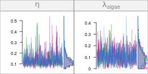
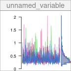
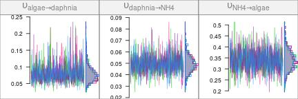
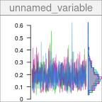
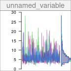

One of the advantages of Bayesian MCMC analysis is the ability to compute derived parameters from the parameters sampled during MCMC. Since MCMC chains are available for the primary parameters, chains can also be calculated for the derived parameters, thus providing posterior samples for those derived parameters which were not sampled themselves during the MCMC run.

## Preparation

In this vignette, we wil use the same network model as in the [Quick Start](tutorial-010-quick-start.html) tutorial.


```r
library(isotracer)
library(tibble)
```


```r
exp <- tibble::tribble(
  ~time.day,  ~species, ~biomass, ~prop15N,
          0,   "algae",     1.02,  0.00384,
          1,   "algae",       NA,   0.0534,
        1.5,   "algae",    0.951,       NA,
          2,   "algae",    0.889,   0.0849,
        2.5,   "algae",       NA,   0.0869,
          3,   "algae",    0.837,   0.0816,
          0, "daphnia",     1.74,  0.00464,
          1, "daphnia",       NA,  0.00493,
        1.5, "daphnia",     2.48,       NA,
          2, "daphnia",       NA,  0.00831,
        2.5, "daphnia",     2.25,       NA,
          3, "daphnia",     2.15,   0.0101,
          0,     "NH4",    0.208,     0.79,
          1,     "NH4",    0.227,       NA,
        1.5,     "NH4",       NA,    0.482,
          2,     "NH4",    0.256,    0.351,
        2.5,     "NH4",       NA,    0.295,
          3,     "NH4",     0.27,        NA
  )

# Separate initial conditions and observations
inits <- exp %>% filter(time.day == 0)
obs <- exp %>% filter(time.day > 0)

# Build the network model
mod <- new_networkModel() %>%
  set_topo("NH4 -> algae -> daphnia -> NH4") %>%
  set_init(inits, comp = "species", size = "biomass",
           prop = "prop15N") %>%
  set_obs(obs, comp = "species", size = "biomass",
          prop = "prop15N", time = "time.day")
```

```
## Using default distribution family for proportions ("gamma_cv").
```

```
##   (eta is the coefficient of variation of gamma distributions.)
```

```
## Using default distribution family for sizes ("normal_cv").
```

```
##   (zeta is the coefficient of variation of normal distributions.)
```

```r
# Set reasonable but vague priors for this model
mod <- set_priors(mod, normal_p(0, 5))
```

We run the MCMC sampler to fit the model:


```r
fit <- run_mcmc(mod, iter = 1000)
plot(fit)
# Note: the figure below only shows a few of the traceplots for vignette concision
```



## Selecting primary parameters

The primary parameters sampled during MCMC are:


```r
coda::varnames(fit)
```

```
## [1] "eta"                      "lambda_algae"             "lambda_daphnia"          
## [4] "lambda_NH4"               "upsilon_algae_to_daphnia" "upsilon_daphnia_to_NH4"  
## [7] "upsilon_NH4_to_algae"     "zeta"
```

We can select parameters using the `select()` function. For example:


```r
plot(fit %>% select(zeta))
```



Note that selecting parameters in a MCMC output uses partial matching:


```r
plot(fit %>% select(upsilon))
```



Selecting chains with `select()` is mostly useful in interactive mode, when exploring the results of an MCMC run. You can select individual parameters without any partial matching using the unambiguous`[, ""]` notation:


```r
summary(fit[, "eta"])
```

```
## 
## Iterations = 501:1000
## Thinning interval = 1 
## Number of chains = 4 
## Sample size per chain = 500 
## 
## 1. Empirical mean and standard deviation for each variable,
##    plus standard error of the mean:
## 
##           Mean             SD       Naive SE Time-series SE 
##       0.134047       0.054416       0.001217       0.002234 
## 
## 2. Quantiles for each variable:
## 
##    2.5%     25%     50%     75%   97.5% 
## 0.06749 0.09794 0.12068 0.15440 0.27001
```

The `[, ""]` notation is the one to use when you want to combine primary parameters into derived parameters through calculation.

## Calculating derived parameters

Basic arithmetic operations as well as $\log$ and $\exp$ can be used when doing calculation on parameter chains. For example, to calculate the turnover rate of algae (i.e. the proportion of nutrient exiting the algae compartment per unit time), we can sum the rates of all the outgoing fluxes from algae, in this case the transfer rate from algae to daphnia and the loss rate from algae:


```r
trate_algae <- fit[, "upsilon_algae_to_daphnia"] + fit[, "lambda_algae"]
```

The newly formed object, `trate_algae`, is a legitimate `mcmc.list` object itself:


```r
str(trate_algae)
```

```
## List of 4
##  $ : 'mcmc' num [1:500] 0.132 0.235 0.173 0.209 0.214 ...
##   ..- attr(*, "mcpar")= num [1:3] 501 1000 1
##  $ : 'mcmc' num [1:500] 0.224 0.238 0.245 0.209 0.201 ...
##   ..- attr(*, "mcpar")= num [1:3] 501 1000 1
##  $ : 'mcmc' num [1:500] 0.196 0.2494 0.1956 0.0881 0.2327 ...
##   ..- attr(*, "mcpar")= num [1:3] 501 1000 1
##  $ : 'mcmc' num [1:500] 0.1167 0.0904 0.0959 0.1199 0.0702 ...
##   ..- attr(*, "mcpar")= num [1:3] 501 1000 1
##  - attr(*, "class")= chr [1:3] "derived.mcmc.list" "networkModelStanfit" "mcmc.list"
```

All the usual operations done on `mcmc.list` objects can be used with it, such as visualizing the trace:


```r
plot(trate_algae)
```



or calculating summaries:


```r
summary(trate_algae)
```

```
## 
## Iterations = 501:1000
## Thinning interval = 1 
## Number of chains = 4 
## Sample size per chain = 500 
## 
## 1. Empirical mean and standard deviation for each variable,
##    plus standard error of the mean:
## 
##           Mean             SD       Naive SE Time-series SE 
##       0.181578       0.070155       0.001569       0.002509 
## 
## 2. Quantiles for each variable:
## 
##    2.5%     25%     50%     75%   97.5% 
## 0.06804 0.13364 0.17419 0.22272 0.32945
```

A derived parameter can itself be used in subsequent calculations! For example, if we want to calculate the turnover time for the nutrient in algae, we can take the inverse of the turnover rate:


```r
ttime_algae <- 1 / trate_algae
plot(ttime_algae)
```



<nav aria-label="Page navigation">
 <ul class="pagination justify-content-end">
  <li class="page-item"><a class="page-link" href="tutorial-100-posterior-predictive-checks.html">Previous: Posterior predictive checks</a></li>
  <li class="page-item"><a class="page-link" href="tutorial-120-howto-simulations.html">Next: Model comparison with PSIS-LOO cross-validation</a></li>
 </ul>
</nav>
