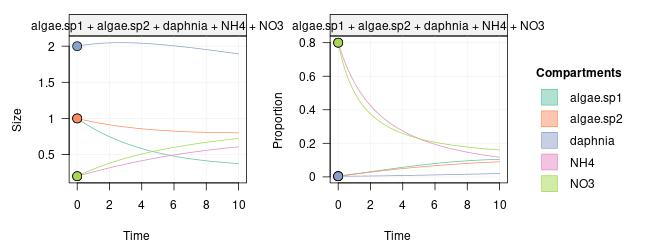
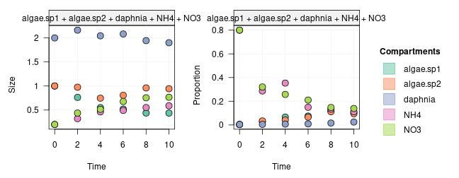
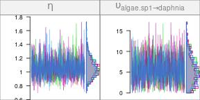
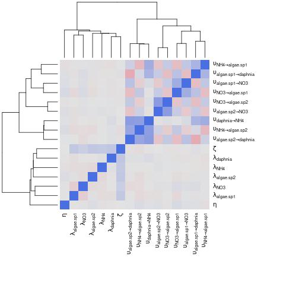
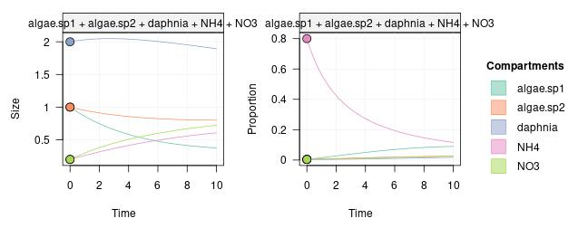
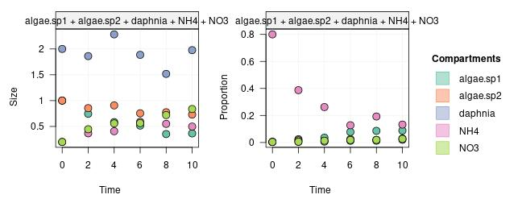
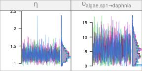
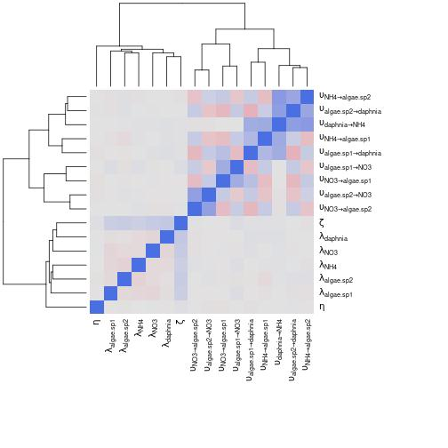

Under certain circumstances, some parameters might be hard to estimate for a given network model. This might be the case for example when two sources with the same tracer profile are consumed by another compartment, which makes estimating the proportion of each source in the consumer diet difficult.

Here again, using simulations to test for parameter identifiability can help to identify problems and search for solutions. In the similar sources problem mentioned above, one solution might be to have several replicates in which the isotopic profiles of the sources vary in opposite ways.

In this vignette, we'll illustrate how to use simulated data to detect this kind of problem and to test different approaches to solve it.


```r
library(isotracer)
library(tidyverse)
```


## A problematic design

Let's start with a simple design. We use again a simple aquarium experiment with dissolved nutrients, algae and Daphnia, but this time we will assume that two algal species are present in the aquarium and that they can feed on both ammonium (NH4) and nitrate (NO3):


```r
mod <- new_networkModel() %>%
  set_topo(c("NH4, NO3 -> algae.sp1, algae.sp2 -> daphnia -> NH4",
             "algae.sp1, algae.sp2 -> NO3"))
```

```
## Using default distribution family for proportions ("gamma_cv").
```

```
##   (eta is the coefficient of variation of gamma distributions.)
```

```
## Using default distribution family for sizes ("normal_cv").
```

```
##   (zeta is the coefficient of variation of normal distributions.)
```

Let's set up some initial values:


```r
inits <- tibble::tribble(
     ~comps, ~sizes, ~props,
      "NH4",    0.2,    0.8, 
      "NO3",    0.2,    0.8, 
  "algae.sp1",    1,  0.004,
  "algae.sp2",    1,  0.004,
  "daphnia",      2,  0.004)
mod <- mod %>% set_init(inits, comp = "comps", size = "sizes", prop = "props")
```

What are the parameters of the model?


```r
params(mod)
```

```
## # A tibble: 16 × 2
##    in_model                     value
##    <chr>                        <dbl>
##  1 eta                             NA
##  2 lambda_algae.sp1                NA
##  3 lambda_algae.sp2                NA
##  4 lambda_daphnia                  NA
##  5 lambda_NH4                      NA
##  6 lambda_NO3                      NA
##  7 upsilon_algae.sp1_to_daphnia    NA
##  8 upsilon_algae.sp1_to_NO3        NA
##  9 upsilon_algae.sp2_to_daphnia    NA
## 10 upsilon_algae.sp2_to_NO3        NA
## 11 upsilon_daphnia_to_NH4          NA
## 12 upsilon_NH4_to_algae.sp1        NA
## 13 upsilon_NH4_to_algae.sp2        NA
## 14 upsilon_NO3_to_algae.sp1        NA
## 15 upsilon_NO3_to_algae.sp2        NA
## 16 zeta                            NA
```

Let's assume that the two algae species have different preference for ammonium and nitrate:


```r
params <- c("upsilon_NH4_to_algae.sp1" = 0.07,
            "upsilon_NO3_to_algae.sp1" = 0.01,
            "upsilon_NH4_to_algae.sp2" = 0.02,
            "upsilon_NO3_to_algae.sp2" = 0.06)
```

We will simulate the case where Daphnia only consumes the first species of algae:


```r
params <- c(params, "upsilon_algae.sp1_to_daphnia" = 0.12,
            "upsilon_algae.sp2_to_daphnia" = 0)
```

and we will set some excretion rates for each species:


```r
params <- c(params, "upsilon_algae.sp1_to_NO3" = 0.05,
            "upsilon_algae.sp2_to_NO3" = 0.07,
            "upsilon_daphnia_to_NH4" = 0.04)
```

We assume that the aquarium is a closed system and that there are no losses (i.e. no nutrient exits the network system):


```r
params <- c(params, "lambda_NH4" = 0, "lambda_NO3" = 0,
            "lambda_algae.sp1" = 0, "lambda_algae.sp2" = 0,
            "lambda_daphnia" = 0)
```

Finally, we set up the variability of compartment sizes and tracer proportions:


```r
params <- c(params, "eta" = 0.2, "zeta" = 0.1)
```

That was quite a lot of parameters to define! Let's add them all to the model and run one projection to see how things look like:


```r
mod <- mod %>%
  set_params(params)
proj <- mod %>% project(end = 10)
plot(proj)
```



Looks good! Now let's simulate some observed data from this system:


```r
spl <- proj %>% sample_from(at = c(2, 4, 6, 8, 10))
spl
```

```
## # A tibble: 25 × 4
##     time comp       size   prop
##    <dbl> <chr>     <dbl>  <dbl>
##  1     2 algae.sp1 0.763 0.0282
##  2     4 algae.sp1 0.551 0.0661
##  3     6 algae.sp1 0.521 0.0750
##  4     8 algae.sp1 0.438 0.119 
##  5    10 algae.sp1 0.437 0.106 
##  6     2 algae.sp2 0.975 0.0340
##  7     4 algae.sp2 0.747 0.0414
##  8     6 algae.sp2 0.806 0.0659
##  9     8 algae.sp2 0.960 0.112 
## 10    10 algae.sp2 0.944 0.0944
## # ℹ 15 more rows
```

Let's add this data to the model:


```r
mod <- mod %>% set_obs(spl, comp = "comp", size = "size", prop = "prop",
                       time = "time")
plot(mod)
```



We are ready to set some reasonable vague priors and run the MCMC fit:


```r
mod <- set_priors(mod, normal_p(0, 6))
```


```r
run <- run_mcmc(mod, iter = 1000)
plot(run)
# Note: the figure below only shows a few of the traceplots for vignette concision
```



Notice how spread the posteriors for some parameters are. For example,  compare the shape of the histograms for $\eta$ and for $\upsilon_{\textrm{daphnia} \leftarrow \textrm{algae.sp1}}$: the shape of the first one is quite concentrated around its median, while the second one is more spread over the posterior range (we are considering here the relative histogram shapes, not the numerical ranges of the posteriors).

In addition, the chains for the uptake rates from nutrients to the algae species, and from algae to Daphnia, are extremely correlated, as visible on the heatmap below:


```r
mcmc_heatmap(run)
```



We have low identifiability for those parameters: many combinations of their values are plausible, but the model does not have enough information to decide which between them. In this particular example, one way to break those chain correlations is to have an experimental design where the nutrient sources are marked in different proportions.

## An improved design

Let's simulate the data we would get if we started with only NH4 being enriched in marker, while NO3 starts with the background isotopic signature. For this, we have to modify the initial conditions:


```r
inits_impr <- tibble::tribble(
     ~comps, ~sizes, ~props,
      "NH4",    0.2,    0.8, 
      "NO3",    0.2,  0.004,
  "algae.sp1",    1,  0.004,
  "algae.sp2",    1,  0.004,
  "daphnia",      2,  0.004)
mod_impr <- mod %>% set_init(inits_impr, comp = "comps", size = "sizes", prop = "props")
```

Let's see how the trajectories look like now:


```r
proj <- mod_impr %>% set_obs(NULL) %>% project(end = 10)
plot(proj)
```



Nice! Notice how the trajectories for the proportions of marked tracer differ between algae species with those improved initial conditions, compared to what we had before.

Let's simulate some observations:


```r
spl <- proj %>% sample_from(at = c(2, 4, 6, 8, 10))
```

and let's add those to the model:


```r
mod_impr <- mod_impr %>% set_obs(spl, comp = "comp", size = "size", prop = "prop",
                                 time = "time")
plot(mod_impr)
```



We are ready to run the MCMC fit:


```r
run_impr <- run_mcmc(mod_impr, iter = 1000)
plot(run_impr)
# Note: the figure below only shows a few of the traceplots for vignette concision
```


```
## Warning: There were 10 divergent transitions after warmup. See
## https://mc-stan.org/misc/warnings.html#divergent-transitions-after-warmup
## to find out why this is a problem and how to eliminate them.
```

```
## Warning: Examine the pairs() plot to diagnose sampling problems
```

```
## Warning: Tail Effective Samples Size (ESS) is too low, indicating posterior variances and tail quantiles may be unreliable.
## Running the chains for more iterations may help. See
## https://mc-stan.org/misc/warnings.html#tail-ess
```



The uncertainty in the posteriors of the uptake rates seem to have decreased a lot. Let's double-check with a heatmap:


```r
mcmc_heatmap(run_impr)
```



This is much better than before: now we can identify most of the parameters without problem.

As illustrated with this example, running simulations before performing the actual experiment is a great way to decide on an efficient experimental design. This is especially important when running tracer addition experiments in natural systems such as streams or lakes, where each experiment is a huge investment in time and resources.

<nav aria-label="Page navigation">
 <ul class="pagination justify-content-end">
  <li class="page-item"><a class="page-link" href="tutorial-120-howto-simulations.html">Previous: How to simulate experiments</a></li>
  <li class="page-item">(No next tutorial)</li>
 </ul>
</nav>
